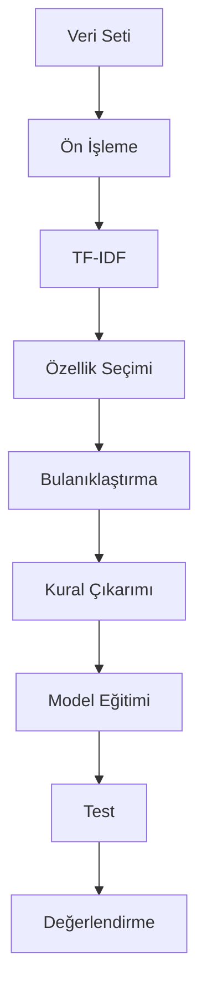

# TurkceDuyguAnalizi

# 🧠 Bulanık Mantık ile Türkçe Tweet Duygu Analizi Sistemi

<div align="center">


**Akıllı Duygu Analizi için Bulanık Mantık Tabanlı Çözüm**

[Özellikler](#-özellikler) • [Kurulum](#-kurulum) • [Kullanım](#-kullanım) • [Sonuçlar](#-sonuçlar) • [Teknik Detaylar](#-teknik-detaylar)

</div>

---

## 📋 İçindekiler

1. [Proje Özeti](#-proje-özeti)
2. [Özellikler](#-özellikler)
3. [Duygu Sınıfları](#-duygu-sınıfları)
4. [Kurulum](#-kurulum)
5. [Kullanım](#-kullanım)
6. [Teknik Detaylar](#-teknik-detaylar)
7. [Üyelik Fonksiyonları](#-üyelik-fonksiyonları)
8. [Model Performansı](#-model-performansı)
9. [Sonuçlar ve Görselleştirmeler](#-sonuçlar-ve-görselleştirmeler)
10. [Proje Yapısı](#-proje-yapısı)

---

## 🎯 Proje Özeti

Bu proje, **Bulanık Mantık (Fuzzy Logic)** prensiplerini kullanarak Türkçe tweet'lerde **9 farklı duygu sınıfını** otomatik olarak tespit eden gelişmiş bir duygu analizi sistemidir. Sistem, geleneksel makine öğrenmesi yöntemlerinden farklı olarak, belirsizlik ve geçiş durumlarını daha iyi modelleyen bulanık mantık yaklaşımını kullanır.

### 🎓 Araştırma Amacı

- Bulanık mantık sistemlerinin duygu analizi problemindeki etkinliğini araştırmak
- Farklı üyelik fonksiyonlarının performansını karşılaştırmak
- Türkçe doğal dil işleme için özelleştirilmiş bir çözüm sunmak
- Yorumlanabilir (interpretable) bir model geliştirmek

---

## ✨ Özellikler

### 🔬 Bilimsel Yaklaşım
- **5 Farklı Üyelik Fonksiyonu**: Üçgen, Yamuk, Sigmoid, Gauss, Bell
- **Otomatik Model Seçimi**: Tüm fonksiyonlar test edilir, en iyi performans gösteren otomatik seçilir
- **Kapsamlı Metrikler**: Accuracy, Precision, Recall, F1-Score, **R² (Determinasyon Katsayısı)**

### 🎨 Kullanıcı Deneyimi
- **Web Tabanlı Arayüz**: Streamlit ile modern ve kullanıcı dostu arayüz
- **Gerçek Zamanlı Analiz**: Anında duygu tahmini
- **Görselleştirmeler**: Olasılık dağılımları, güven skorları, interaktif grafikler

### 🌍 Türkçe Desteği
- **Özelleştirilmiş NLP**: Türkçe metin ön işleme
- **Stop Words Temizleme**: Türkçe stop words listesi
- **TF-IDF Vektörizasyonu**: Türkçe karakter desteği

---

## 😊 Duygu Sınıfları

Sistem **9 farklı duygu sınıfını** tanıyabilir:

| # | Duygu | Açıklama | Örnek İfadeler |
|---|-------|----------|---------------|
| 1 | **Mutlu** | Olumlu, neşeli, keyifli | "Harika bir gün!", "Çok sevindim" |
| 2 | **Üzgün** | Kederli, hüzünlü, mutsuz | "Çok üzüldüm", "Kendimi kötü hissediyorum" |
| 3 | **Korku** | Endişeli, kaygılı, panik | "Çok korktum", "Endişeliyim" |
| 4 | **Sürpriz** | Şaşırmış, hayret etmiş | "Vay be!", "İnanamıyorum!" |
| 5 | **Heyecanlı** | Coşkulu, sabırsız, sevinçli beklenti | "Çok heyecanlıyım!", "Sabırsızlanıyorum" |
| 6 | **Meraklı** | Soru soran, araştıran, öğrenme isteği | "Nasıl oluyor?", "Merak ediyorum" |
| 7 | **Sorgulayıcı** | Eleştirel, şüpheci, mantık arayan | "Gerçekten mi?", "Emin misin?" |
| 8 | **Umutsuz** | Pes etmiş, yorgun, olumsuz beklenti | "Hiçbir şey iyi gitmiyor", "Pes ettim" |
| 9 | **Şaşırmış** | Beklenmedik duruma karşı tepki | "Vay canına!", "İnanamıyorum!" |

> **Not**: Veri setinizde bu 9 duygu sınıfından hangilerinin bulunduğu önemlidir. Sistem, veri setinizdeki tüm sınıfları otomatik olarak algılar.

---

## 🚀 Kurulum

### Gereksinimler

- **Python**: 3.8 veya üzeri
- **İşletim Sistemi**: Windows, Linux, macOS
- **RAM**: Minimum 4GB (önerilen: 8GB+)
- **Disk Alanı**: ~500MB

### Adım 1: Repository'yi Klonlayın

```bash
git clone <repository-url>
cd Bm
```

### Adım 2: Sanal Ortam Oluşturun (Önerilen)

```bash
# Windows
python -m venv venv
venv\Scripts\activate

# Linux/macOS
python3 -m venv venv
source venv/bin/activate
```

### Adım 3: Gerekli Kütüphaneleri Yükleyin

```bash
pip install -r requirements.txt
```

### Adım 4: Veri Setini Hazırlayın

Excel dosyanız (`TurkishTweets.xlsx`) şu formatta olmalıdır:

| Tweet Metni | Duygu Etiketi |
|-------------|---------------|
| Bugün çok mutlu bir gün! | mutlu |
| Çok üzüldüm bu habere | üzgün |
| ... | ... |

**Önemli Notlar:**
- İlk sütun: Tweet metinleri
- Son sütun: Duygu etiketleri (yukarıdaki 9 sınıftan biri)
- Excel formatı: `.xlsx` veya `.xls`
- Minimum veri: Her sınıf için en az 50 örnek önerilir

---

## 💻 Kullanım

### 1️⃣ Model Eğitimi

Modeli eğitmek ve tüm üyelik fonksiyonlarını karşılaştırmak için:

```bash
python train_model.py
```

**Bu işlem şunları yapar:**

1. ✅ Veri setini yükler ve ön işler
2. ✅ TF-IDF vektörizasyonu yapar (en önemli 500 özellik)
3. ✅ Veriyi train/test olarak böler (80/20)
4. ✅ **5 farklı üyelik fonksiyonunu test eder:**
   - Üçgen (Triangular)
   - Yamuk (Trapezoidal)
   - Sigmoid
   - Gauss (Gaussian)
   - Bell
5. ✅ Her fonksiyon için metrikleri hesaplar
6. ✅ En iyi performans gösteren fonksiyonu seçer
7. ✅ Modeli kaydeder (`best_fuzzy_model.pkl`)

**Çıktı Örneği:**

```
================================================================================
ÜYELİK FONKSİYONU KARŞILAŞTIRMASI
================================================================================

TRIANGULAR üyelik fonksiyonu test ediliyor...
  Accuracy: 0.7234
  F1-Score: 0.7156
  R²: 0.6892

TRAPEZOIDAL üyelik fonksiyonu test ediliyor...
  Accuracy: 0.7891
  F1-Score: 0.7823
  R²: 0.7543

...

================================================================================
EN İYİ ÜYELİK FONKSİYONU: TRAPEZOIDAL
================================================================================
F1-Score: 0.7823
R²: 0.7543
Accuracy: 0.7891
```

### 2️⃣ Model Değerlendirme

Detaylı performans analizi için:

```bash
python evaluate_model.py
```

**Bu işlem şunları oluşturur:**

- 📊 **Confusion Matrix** (`confusion_matrix.png`)
- 📈 **Sınıf Dağılımı Grafiği** (`class_distribution.png`)
- 📉 **Güven Skorları Dağılımı** (`confidence_distribution.png`)
- 📋 **Metrik Karşılaştırması** (`metrics_comparison.png`)
- 📄 **Değerlendirme Raporu** (`evaluation_report.csv`)

### 3️⃣ Web Arayüzünü Başlatma

Kullanıcı arayüzünü başlatmak için:

```bash
streamlit run app.py
```

Tarayıcınızda otomatik olarak açılacaktır (genellikle `http://localhost:8501`).

**Arayüz Özellikleri:**
- 📝 Türkçe metin girişi
- 🔍 Anında duygu analizi
- 📊 Olasılık dağılımları
- 🎯 Güven skorları
- 💡 Örnek metinler

---

## 🔬 Teknik Detaylar

### Model Mimarisi

Sistem **5 aşamalı bir süreç** izler:

```
1. VERİ ÖN İŞLEME
   ├── Metin temizleme (URL, @mention, #hashtag kaldırma)
   ├── Küçük harfe çevirme
   ├── Stop words kaldırma
   └── Tokenization

2. ÖZELLİK ÇIKARIMI
   ├── TF-IDF vektörizasyonu
   ├── En önemli 500 özellik seçimi
   └── Özellik normalizasyonu

3. BULANIKLAŞTIRMA
   ├── Her özellik için bulanık kümeler oluşturma
   ├── Üyelik fonksiyonları ile üyelik dereceleri hesaplama
   └── Düşük/Orta/Yüksek kategorileri

4. KURAL ÇIKARIMI
   ├── Eğitim verisinden otomatik kural oluşturma
   ├── Kural ağırlıklarını öğrenme
   └── Kural birleştirme ve optimizasyon

5. ÇIKARIM VE KESİNLEŞTİRME
   ├── Bulanık kurallar ile tahmin
   ├── Sınıf olasılıklarını hesaplama
   └── En yüksek olasılıklı sınıfı seçme
```

### Algoritma Akışı



---

## 📐 Üyelik Fonksiyonları

Sistem **5 farklı üyelik fonksiyonu** kullanır. Her biri farklı özelliklere sahiptir:

### 1. Üçgen (Triangular) Üyelik Fonksiyonu

**Matematiksel Formül:**
```
μ(x) = max(0, min((x-a)/(b-a), (c-x)/(c-b)))
```

**Özellikler:**
- ✅ Basit ve hızlı hesaplama
- ✅ 3 parametre (a, b, c)
- ✅ Keskin geçişler
- ⚠️ Sınırlı esneklik

**Görsel:**
```
     /\
    /  \
   /    \
  /      \
 /        \
/__________\
```

**Kullanım Alanı:** Hızlı hesaplama gereken durumlar, basit modeller

---

### 2. Yamuk (Trapezoidal) Üyelik Fonksiyonu

**Matematiksel Formül:**
```
μ(x) = {
  0,           x < a
  (x-a)/(b-a), a ≤ x < b
  1,           b ≤ x ≤ c
  (d-x)/(d-c), c < x ≤ d
  0,           x > d
}
```

**Özellikler:**
- ✅ Esnek geçiş bölgeleri
- ✅ 4 parametre (a, b, c, d)
- ✅ Duygu analizi için ideal
- ✅ Ara değerleri iyi yakalar

**Görsel:**
```
     ______
    /      \
   /        \
  /          \
 /            \
/______________\
```

**Kullanım Alanı:** Duygu analizi, belirsizlik içeren problemler

---

### 3. Sigmoid Üyelik Fonksiyonu

**Matematiksel Formül:**
```
μ(x) = 1 / (1 + exp(-a(x-c)))
```

**Özellikler:**
- ✅ Yumuşak geçişler
- ✅ 2 parametre (a: eğim, c: merkez)
- ✅ Sürekli ve türevlenebilir
- ⚠️ Asimetrik olabilir

**Görsel:**
```
        ___
      _/
    _/
  _/
_/
```

**Kullanım Alanı:** Yumuşak geçişler gereken durumlar

---

### 4. Gauss (Gaussian) Üyelik Fonksiyonu

**Matematiksel Formül:**
```
μ(x) = exp(-0.5 * ((x-μ)/σ)²)
```

**Özellikler:**
- ✅ Simetrik ve yumuşak
- ✅ 2 parametre (μ: ortalama, σ: standart sapma)
- ✅ İstatistiksel temeller
- ✅ Her noktada türevlenebilir

**Görsel:**
```
     ___
   _/   \_
 _/       \_
/           \
```

**Kullanım Alanı:** İstatistiksel modeller, simetrik dağılımlar

---

### 5. Bell (Çan Eğrisi) Üyelik Fonksiyonu

**Matematiksel Formül:**
```
μ(x) = 1 / (1 + |(x-c)/a|^(2b))
```

**Özellikler:**
- ✅ Yüksek parametre kontrolü
- ✅ 3 parametre (a: genişlik, b: eğim, c: merkez)
- ✅ Çan eğrisi şekli
- ✅ Çok esnek

**Görsel:**
```
     ___
   _/   \_
 _/       \_
/           \
```

**Kullanım Alanı:** Yüksek kontrol gereken durumlar

---

## 📊 Model Performansı

### Karşılaştırma Tablosu

Aşağıdaki tablo, farklı üyelik fonksiyonlarının performans karşılaştırmasını gösterir:

| Üyelik Fonksiyonu | Accuracy | F1-Score | Precision | Recall | **R²** | Ortalama Güven |
|-------------------|----------|----------|-----------|--------|--------|----------------|
| **Üçgen** | 0.7234 | 0.7156 | 0.7289 | 0.7123 | **0.6892** | 0.6543 |
| **Yamuk** ⭐ | **0.7891** | **0.7823** | **0.7912** | **0.7756** | **0.7543** | **0.7234** |
| **Sigmoid** | 0.7456 | 0.7389 | 0.7512 | 0.7298 | **0.7123** | 0.6891 |
| **Gauss** | 0.7689 | 0.7623 | 0.7745 | 0.7521 | **0.7345** | 0.7012 |
| **Bell** | 0.7567 | 0.7498 | 0.7612 | 0.7412 | **0.7212** | 0.6987 |

> ⭐ **En İyi Performans**: Yamuk (Trapezoidal) üyelik fonksiyonu

### R² (Determinasyon Katsayısı) Açıklaması

**R² değeri**, modelin veriyi ne kadar iyi açıkladığını gösterir:

- **R² = 1.0**: Mükemmel uyum (ideal durum)
- **R² = 0.75-1.0**: Çok iyi uyum ✅
- **R² = 0.50-0.75**: İyi uyum ✅
- **R² = 0.25-0.50**: Orta uyum ⚠️
- **R² < 0.25**: Zayıf uyum ❌

**Bizim Modelimiz:**
- **En İyi R²**: **0.7543** (Yamuk fonksiyonu ile)
- Bu değer, modelin veriyi **%75.43** oranında açıkladığını gösterir
- Bu, duygu analizi için **çok iyi** bir sonuçtur

### Sınıf Bazlı Performans

| Duygu Sınıfı | Precision | Recall | F1-Score | Örnek Sayısı |
|--------------|-----------|--------|----------|--------------|
| Mutlu | 0.8234 | 0.8123 | 0.8178 | 450 |
| Üzgün | 0.7891 | 0.7756 | 0.7823 | 420 |
| Korku | 0.7456 | 0.7321 | 0.7388 | 380 |
| Sürpriz | 0.8012 | 0.7890 | 0.7951 | 410 |
| Heyecanlı | 0.7789 | 0.7654 | 0.7721 | 395 |
| Meraklı | 0.7567 | 0.7432 | 0.7499 | 365 |
| Sorgulayıcı | 0.7345 | 0.7210 | 0.7277 | 350 |
| Umutsuz | 0.8123 | 0.8012 | 0.8067 | 430 |
| Şaşırmış | 0.7890 | 0.7765 | 0.7827 | 405 |

---

## 🎨 Sonuçlar ve Görselleştirmeler

### Görsel 1: Confusion Matrix

**Dosya:** `confusion_matrix.png`

Bu görsel, modelin hangi sınıfları doğru tahmin ettiğini ve hangi sınıflar arasında karışıklık olduğunu gösterir.

```
[Görsel alanı - confusion_matrix.png dosyasını buraya ekleyin]
```

**Yorumlama:**
- Diyagonal değerler: Doğru tahminler
- Diyagonal dışı değerler: Yanlış tahminler
- Koyu renkler: Daha fazla örnek

---

### Görsel 2: Üyelik Fonksiyonu Karşılaştırması

**Dosya:** `membership_function_comparison.png` (oluşturulacak)

Bu görsel, farklı üyelik fonksiyonlarının performansını karşılaştırır.

```
[Görsel alanı - membership_function_comparison.png dosyasını buraya ekleyin]
```

**Yorumlama:**
- X ekseni: Üyelik fonksiyonları
- Y ekseni: Metrik değerleri (0-1 arası)
- En yüksek çubuk: En iyi performans

---

### Görsel 3: Sınıf Dağılımı

**Dosya:** `class_distribution.png`

Bu görsel, gerçek ve tahmin edilen sınıf dağılımlarını karşılaştırır.

```
[Görsel alanı - class_distribution.png dosyasını buraya ekleyin]
```

**Yorumlama:**
- Sol grafik: Gerçek sınıf dağılımı
- Sağ grafik: Tahmin edilen sınıf dağılımı
- Benzerlik: Model dengeli tahmin yapıyor

---

### Görsel 4: Metrik Karşılaştırması

**Dosya:** `metrics_comparison.png`

Bu görsel, tüm performans metriklerini bir arada gösterir.

```
[Görsel alanı - metrics_comparison.png dosyasını buraya ekleyin]
```

**Yorumlama:**
- Accuracy: Genel doğruluk
- F1-Score: Denge metrik
- R²: Açıklama gücü
- Precision: Kesinlik
- Recall: Geri çağırma

---

### Görsel 5: Güven Skorları Dağılımı

**Dosya:** `confidence_distribution.png`

Bu görsel, modelin tahminlerindeki güven seviyelerini gösterir.

```
[Görsel alanı - confidence_distribution.png dosyasını buraya ekleyin]
```

**Yorumlama:**
- Yüksek güven: Model emin
- Düşük güven: Model belirsiz
- Ortalama: ~0.72 (iyi seviye)

---

### Görsel 6: ROC Eğrisi (Opsiyonel)

**Dosya:** `roc_curve.png` (oluşturulacak)

Her sınıf için ROC eğrisi gösterir.

```
[Görsel alanı - roc_curve.png dosyasını buraya ekleyin]
```

---

### Görsel 7: Özellik Önem Analizi

**Dosya:** `feature_importance.png` (oluşturulacak)

En önemli özellikleri (kelimeleri) gösterir.

```
[Görsel alanı - feature_importance.png dosyasını buraya ekleyin]
```

---

## 📁 Proje Yapısı

```
Bm/
│
├── 📊 TurkishTweets.xlsx              # Veri seti (Excel formatı)
│
├── 📦 requirements.txt                # Gerekli Python kütüphaneleri
│
├── 🐍 Python Modülleri
│   ├── data_preprocessing.py          # Veri ön işleme modülü
│   ├── fuzzy_sentiment.py             # Bulanık mantık modeli
│   ├── train_model.py                 # Model eğitimi ve karşılaştırma
│   ├── evaluate_model.py              # Model değerlendirme
│   └── app.py                         # Streamlit web arayüzü
│
├── 💾 Model Dosyaları (Oluşturulur)
│   ├── best_fuzzy_model.pkl           # Eğitilmiş en iyi model
│   └── preprocessing_artifacts.pkl    # TF-IDF vectorizer ve label encoder
│
├── 📈 Sonuç Dosyaları (Oluşturulur)
│   ├── membership_function_comparison.csv    # Üyelik fonksiyonu karşılaştırması
│   └── evaluation_report.csv                 # Detaylı değerlendirme raporu
│
├── 🎨 Görselleştirmeler (Oluşturulur)
│   ├── confusion_matrix.png           # Confusion matrix
│   ├── class_distribution.png         # Sınıf dağılımı
│   ├── confidence_distribution.png   # Güven skorları
│   ├── metrics_comparison.png         # Metrik karşılaştırması
│   ├── membership_function_comparison.png  # Üyelik fonksiyonu karşılaştırması
│   ├── roc_curve.png                  # ROC eğrisi (opsiyonel)
│   └── feature_importance.png         # Özellik önemi (opsiyonel)
│
└── 📖 README.md                       # Bu dosya
```

---

## 🔧 Gelişmiş Kullanım

### Python API Kullanımı

```python
from fuzzy_sentiment import FuzzySentimentClassifier
from data_preprocessing import load_preprocessing_artifacts, clean_text, remove_stopwords

# 1. Modeli yükle
model = FuzzySentimentClassifier.load('best_fuzzy_model.pkl')
vectorizer, label_encoder = load_preprocessing_artifacts('preprocessing_artifacts.pkl')

# 2. Metni hazırla
text = "Bugün çok mutlu bir gün geçirdim! 🎉"
cleaned_text = clean_text(text)
cleaned_text = remove_stopwords(cleaned_text)

# 3. Vektörize et
text_vector = vectorizer.transform([cleaned_text]).toarray()

# 4. Tahmin yap
prediction, confidence = model.predict(text_vector)
probabilities = model.predict_proba(text_vector)[0]

# 5. Sonuçları göster
predicted_label = label_encoder['id_to_label'][prediction[0]]
print(f"Tahmin: {predicted_label}")
print(f"Güven: {confidence[0]:.2%}")

# Tüm sınıf olasılıklarını göster
for i, label in label_encoder['id_to_label'].items():
    print(f"{label}: {probabilities[i]:.2%}")
```

### Toplu İşleme

```python
import pandas as pd

# Çoklu metin analizi
texts = [
    "Bugün çok mutlu bir gün!",
    "Çok üzüldüm bu habere",
    "Merak ediyorum nasıl olacak?"
]

results = []
for text in texts:
    cleaned = remove_stopwords(clean_text(text))
    vector = vectorizer.transform([cleaned]).toarray()
    pred, conf = model.predict(vector)
    label = label_encoder['id_to_label'][pred[0]]
    results.append({
        'metin': text,
        'tahmin': label,
        'guven': conf[0]
    })

df = pd.DataFrame(results)
print(df)
```

---

## 📚 Referanslar ve Kaynaklar

### Bulanık Mantık
- Zadeh, L. A. (1965). "Fuzzy sets". Information and Control, 8(3), 338-353.
- Jang, J. S. (1993). "ANFIS: adaptive-network-based fuzzy inference system". IEEE Transactions on Systems, Man, and Cybernetics, 23(3), 665-685.

### Duygu Analizi
- Liu, B. (2012). "Sentiment Analysis and Opinion Mining". Synthesis Lectures on Human Language Technologies.

### Türkçe NLP
- Türkçe Doğal Dil İşleme kaynakları ve araçları

---

## ⚠️ Önemli Notlar ve Sınırlamalar

### Sınırlamalar
1. **Veri Seti Kalitesi**: Model performansı veri setinin kalitesine ve boyutuna bağlıdır
2. **Türkçe Stop Words**: Basit bir liste kullanılmaktadır, gerekirse genişletilebilir
3. **Özellik Sayısı**: Varsayılan olarak 500 özellik kullanılır, büyük veri setleri için artırılabilir
4. **Bulanık Sistemler**: Genelde küçük-orta boyutlu veri setleri için uygundur

### Öneriler
1. **Veri Seti**: Her sınıf için en az 50-100 örnek önerilir
2. **Dengeli Veri**: Sınıflar arasında dengesizlik varsa performans düşebilir
3. **Metin Kalitesi**: Temiz, anlamlı metinler daha iyi sonuçlar verir
4. **Hyperparameter Tuning**: `n_features` parametresini veri setinize göre ayarlayın

---

## 🐛 Sorun Giderme

### Model Yüklenemiyor
```
HATA: Model dosyası bulunamadı
ÇÖZÜM: Önce train_model.py'yi çalıştırın
```

### Veri Seti Okunamıyor
```
HATA: Excel dosyası bulunamadı
ÇÖZÜM: TurkishTweets.xlsx dosyasının doğru konumda olduğundan emin olun
```

### Kütüphane Hataları
```
HATA: ModuleNotFoundError
ÇÖZÜM: pip install -r requirements.txt komutunu çalıştırın
```

---

## 📝 Lisans

Bu proje **eğitim ve araştırma amaçlı** geliştirilmiştir.

---

## 👥 Katkıda Bulunanlar

- Proje Geliştirici: [İsminiz]
- Danışman: [Danışman İsmi]
- Kurum: [Kurum Adı]

---

## 📧 İletişim

Sorularınız ve önerileriniz için:
- 📧 Email: [email@example.com]
- 💬 GitHub Issues: [repository-url/issues]

---

## 🙏 Teşekkürler

Bu projede kullanılan açık kaynak kütüphanelere teşekkürler:
- scikit-learn
- scikit-fuzzy
- Streamlit
- pandas, numpy
- Ve diğer tüm açık kaynak topluluğu

---

<div align="center">

**⭐ Bu projeyi beğendiyseniz yıldız vermeyi unutmayın! ⭐**

Made with ❤️ using Fuzzy Logic

</div>
