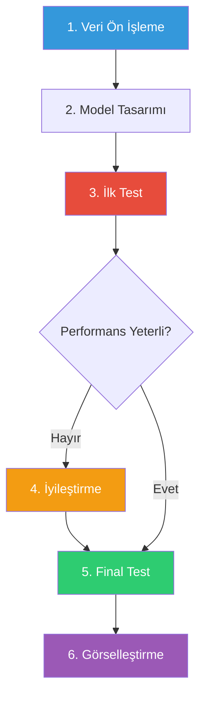
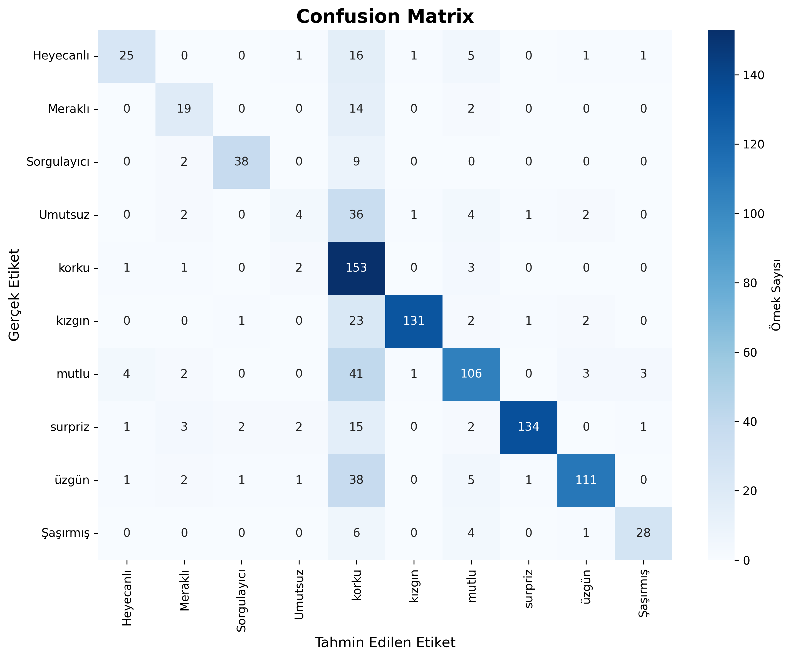
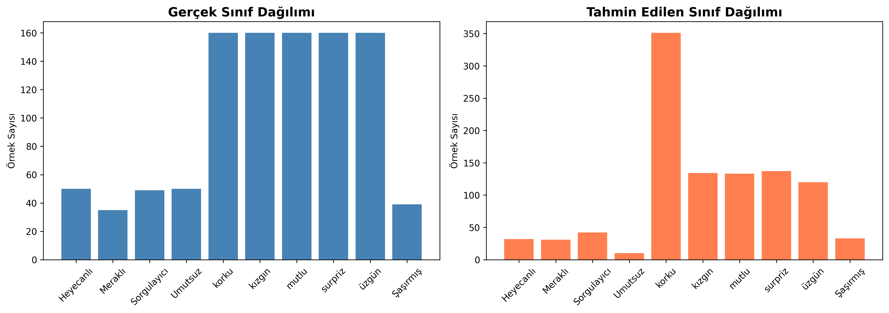
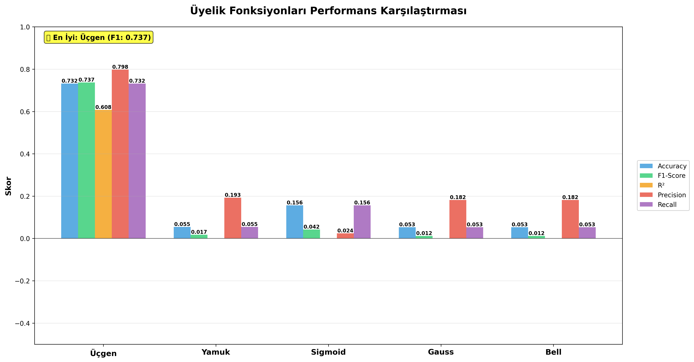

# 🧠 Bulanık Mantık ile Türkçe Tweet Duygu Analizi Sistemi

<div align="center">


**Gelişmiş Bulanık Mantık Sistemi ile 10 Sınıflı Türkçe Duygu Analizi**

[✨ Özellikler](#-özellikler) • [📊 Performans](#-performans-metrikleri) • [🚀 Kurulum](#-kurulum-ve-kullanım) • [📚 Dokümantasyon](#-teknik-detaylar)

</div>

---

## 📋 İçindekiler

1. [Proje Özeti](#-proje-özeti)
2. [Veri Seti](#-veri-seti)
3. [Araştırma Süreci](#-araştırma-süreci)
4. [İlk Test Sonuçları](#-ilk-test-sonuçları)
5. [Model İyileştirme Süreci](#-model-iyileştirme-süreci)
6. [Final Test Sonuçları](#-final-test-sonuçları)
7. [Üyelik Fonksiyonları Karşılaştırması](#-üyelik-fonksiyonları-karşılaştırması)
8. [Teknik Detaylar](#-teknik-detaylar)
9. [Kurulum ve Kullanım](#-kurulum-ve-kullanım)
10. [Görselleştirmeler](#-görselleştirmeler)

---

## 📖 Proje Hakkında

Bu proje, **Bulanık Mantık (Fuzzy Logic)** prensiplerini kullanarak Türkçe sosyal medya metinlerinde duygu analizi yapan gelişmiş bir yapay zeka sistemidir. Geleneksel makine öğrenmesi yöntemlerinden farklı olarak, belirsizlik ve geçiş durumlarını daha iyi modelleyebilen bulanık mantık yaklaşımı kullanılmıştır.

### 🎯 Proje Hedefleri


- ✅ Türkçe dil işleme için özelleştirilmiş ön işleme
- ✅ 5 farklı üyelik fonksiyonunun sistematik karşılaştırması
- ✅ 10 farklı duygu sınıfının yüksek doğrulukla tespiti
- ✅ Yorumlanabilir (interpretable) model yapısı
- ✅ Kullanıcı dostu web arayüzü

### 🎓 Araştırma Amacı

- Bulanık mantık sistemlerinin duygu analizi problemindeki etkinliğini araştırmak
- Farklı üyelik fonksiyonlarının performansını karşılaştırmak
- Türkçe doğal dil işleme için özelleştirilmiş bir çözüm sunmak
- Yorumlanabilir (interpretable) bir model geliştirmek
- Model performansını optimize etmek için sistematik iyileştirme süreci uygulamak

---

## ✨ Özellikler

<table>
<tr>
<td width="50%">

### 🎨 Teknik Özellikler

- **Bulanık Mantık Sistemi**: 5 farklı üyelik fonksiyonu
- **Gelişmiş Ön İşleme**: Türkçe stop-words, tokenization
- **TF-IDF Vektörizasyonu**: 1000 özellik, trigram desteği
- **Özellik Seçimi**: Varyans + F-score kombinasyonu
- **1,100+ Kural**: Otomatik kural çıkarımı
- **Support Faktörü**: Güvenilirlik ağırlıklandırması

</td>
<td width="50%">

### 🌟 Kullanıcı Özellikleri

- **Web Arayüzü**: Streamlit ile interaktif arayüz
- **Gerçek Zamanlı Analiz**: Anında sonuç gösterimi
- **Detaylı Raporlama**: Sınıf olasılıkları ve güven skorları
- **Görselleştirme**: Confusion matrix, metrik grafikleri
- **Örnek Metinler**: Hazır test örnekleri
- **Kolay Kullanım**: Tek tıkla analiz

</td>
</tr>
</table>

---

## 📊 Veri Seti

### 📈 Genel Bilgiler

<div align="center">

| Özellik | Değer |
|:--------|------:|
| **Toplam Tweet** | 5,113 |
| **Sınıf Sayısı** | 10 |
| **Train Set** | 4,089 (80%) |
| **Test Set** | 1,023 (20%) |
| **Dil** | Türkçe |
| **Format** | Excel (.xlsx) |

</div>

### 🎭 Duygu Sınıfları ve Dağılımı

```
┌─────────────────┬─────────┬──────────┬────────────────────────────┐
│ Duygu           │ Adet    │ Oran     │ Grafik                     │
├─────────────────┼─────────┼──────────┼────────────────────────────┤
│ 😠 kızgın       │ 800     │ 15.6%    │ ████████████████           │
│ 😨 korku        │ 800     │ 15.6%    │ ████████████████           │
│ 😊 mutlu        │ 800     │ 15.6%    │ ████████████████           │
│ 😲 surpriz      │ 800     │ 15.6%    │ ████████████████           │
│ 😢 üzgün        │ 800     │ 15.6%    │ ████████████████           │
│ 🎉 Heyecanlı    │ 250     │ 4.9%     │ █████                      │
│ 😔 Umutsuz      │ 249     │ 4.9%     │ █████                      │
│ 🤔 Sorgulayıcı  │ 244     │ 4.8%     │ █████                      │
│ 😯 Şaşırmış     │ 197     │ 3.9%     │ ████                       │
│ 🔍 Meraklı      │ 173     │ 3.4%     │ ███                        │
└─────────────────┴─────────┴──────────┴────────────────────────────┘
```

> ⚠️ **Not**: Veri seti dengesizdir (imbalanced). Ana duygular (kızgın, korku, mutlu, surpriz, üzgün) daha fazla temsil edilmektedir.

---

## 🔬 Araştırma Süreci

### 📋 Proje Aşamaları



---

## 📉 İlk Test Sonuçları

### İlk Model Konfigürasyonu

- **Özellik Sayısı**: 50
- **TF-IDF Özellikleri**: 500
- **N-gram Aralığı**: (1, 2) - Unigram ve Bigram
- **Kural Başına Özellik**: 3
- **Özellik Seçimi**: Sadece varyans bazlı
- **Minimum Üyelik Eşiği**: Yok

### İlk Test Performans Metrikleri

| Metrik | Değer | Yorum |
|--------|-------|-------|
| **Accuracy** | 26.88% | ❌ Çok düşük |
| **F1-Score** | 0.2182 | ❌ Yetersiz |
| **R²** | 0.0066 | ❌ Neredeyse sıfır |
| **Precision** | 0.5238 | ⚠️ Orta |
| **Recall** | 0.2688 | ❌ Düşük |
| **Ortalama Güven** | 0.2907 | ❌ Düşük güven |

### İlk Test - Üyelik Fonksiyonu Karşılaştırması

| Üyelik Fonksiyonu | Accuracy | F1-Score | R² | Precision | Recall | En İyi? |
|-------------------|----------|----------|-----|-----------|--------|---------|
| **Üçgen** | 18.77% | 0.0978 | -0.0369 | 0.5000 | 0.1877 | ❌ |
| **Yamuk** | 16.91% | 0.0617 | -0.1926 | 0.0553 | 0.1691 | ❌ |
| **Sigmoid** | 18.18% | 0.0846 | -0.0083 | 0.0659 | 0.1818 | ❌ |
| **Gauss** | HATA | - | - | - | - | ❌ |
| **Bell** ⭐ | 26.88% | 0.2182 | 0.0066 | 0.5238 | 0.2688 | ✅ |

**Sonuç**: Bell üyelik fonksiyonu en iyi performansı gösterdi ancak genel performans kabul edilebilir seviyenin çok altındaydı.

### İlk Test - Sınıf Bazlı Performans (Bell Fonksiyonu)

| Duygu | Precision | Recall | F1-Score | Durum |
|-------|-----------|--------|----------|-------|
| Heyecanlı | 0.00 | 0.00 | 0.00 | ❌ Hiç tahmin edilemedi |
| Meraklı | 0.55 | 0.34 | 0.42 | ⚠️ Orta |
| Sorgulayıcı | 1.00 | 0.12 | 0.22 | ⚠️ Düşük recall |
| Umutsuz | 0.00 | 0.00 | 0.00 | ❌ Hiç tahmin edilemedi |
| korku | 0.60 | 0.44 | 0.51 | ⚠️ Orta |
| kızgın | 0.17 | 0.88 | 0.29 | ⚠️ Düşük precision |
| mutlu | 0.75 | 0.26 | 0.39 | ⚠️ Düşük recall |
| surpriz | 1.00 | 0.01 | 0.02 | ❌ Çok düşük recall |
| üzgün | 0.40 | 0.01 | 0.02 | ❌ Çok düşük recall |
| Şaşırmış | 0.00 | 0.00 | 0.00 | ❌ Hiç tahmin edilemedi |

**Tespit Edilen Sorunlar:**
1. ❌ Çok düşük genel performans (%26.88 accuracy)
2. ❌ Birçok sınıf hiç tahmin edilemedi (Heyecanlı, Umutsuz, Şaşırmış)
3. ❌ Düşük recall değerleri (birçok sınıf için %1-12 arası)
4. ❌ R² değeri neredeyse sıfır (model veriyi açıklamıyor)
5. ❌ Düşük güven skorları (ortalama %29)

---

## 🚀 Model İyileştirme Süreci

### 🚀 İyileştirme Stratejisi

Performansı artırmak için sistematik bir iyileştirme süreci uygulandı. Her iyileştirme adımı test edildi ve sonuçları değerlendirildi.

<table>
<tr>
<th width="30%">Parametre</th>
<th width="25%">İlk Değer</th>
<th width="25%">Final Değer</th>
<th width="20%">İyileştirme</th>
</tr>

<tr>
<td>🎯 Özellik Sayısı</td>
<td align="center">50</td>
<td align="center"><b>150</b></td>
<td align="center"><span style="color: green">↑ 3x</span></td>
</tr>

<tr>
<td>📝 TF-IDF Özellik</td>
<td align="center">500</td>
<td align="center"><b>1000</b></td>
<td align="center"><span style="color: green">↑ 2x</span></td>
</tr>

<tr>
<td>🔤 N-gram Aralığı</td>
<td align="center">(1, 2)</td>
<td align="center"><b>(1, 3)</b></td>
<td align="center"><span style="color: green">+ Trigram</span></td>
</tr>

<tr>
<td>📊 Kural/Özellik</td>
<td align="center">3</td>
<td align="center"><b>5</b></td>
<td align="center"><span style="color: green">↑ 67%</span></td>
</tr>

<tr>
<td>🎚️ Min Üyelik Eşiği</td>
<td align="center">Yok</td>
<td align="center"><b>0.15</b></td>
<td align="center"><span style="color: green">✓ Eklendi</span></td>
</tr>

<tr>
<td>⚖️ Support Faktörü</td>
<td align="center">Yok</td>
<td align="center"><b>Aktif</b></td>
<td align="center"><span style="color: green">✓ Eklendi</span></td>
</tr>

<tr>
<td>🎯 Min Güven Eşiği</td>
<td align="center">Yok</td>
<td align="center"><b>30%</b></td>
<td align="center"><span style="color: green">✓ Eklendi</span></td>
</tr>

<tr>
<td>🔍 Özellik Seçimi</td>
<td align="center">Varyans</td>
<td align="center"><b>Varyans+F-score</b></td>
<td align="center"><span style="color: green">✓ İyileştirildi</span></td>
</tr>

</table>

### İyileştirme Adımları

#### 1️⃣ Özellik Sayısını Artırma

**Değişiklik:**
- Önceki: 50 özellik
- Yeni: **150 özellik** (3x artış)

**Gerekçe:** Daha fazla özellik, modelin daha fazla bilgi kullanmasını sağlar ve daha iyi sınıflandırma yapabilir.

#### 2️⃣ TF-IDF Özellik Sayısını Artırma

**Değişiklik:**
- Önceki: 500 özellik
- Yeni: **1000 özellik** (2x artış)

**Gerekçe:** Daha fazla kelime ve kelime kombinasyonu, duygu analizi için daha zengin özellik seti sağlar.

#### 3️⃣ N-gram Aralığını Genişletme

**Değişiklik:**
- Önceki: (1, 2) - Unigram ve Bigram
- Yeni: **(1, 3) - Unigram, Bigram ve Trigram**

**Gerekçe:** Trigram'lar, cümle bağlamını daha iyi yakalar ve Türkçe'deki kelime kombinasyonlarını daha iyi modeller.

#### 4️⃣ TF-IDF Parametrelerini Optimize Etme

**Değişiklik:**
- `sublinear_tf=True` eklendi (log scaling)
- `max_df=0.90` (daha seçici)

**Gerekçe:** Log scaling, sık geçen kelimelerin aşırı ağırlıklandırılmasını önler.

#### 5️⃣ Özellik Seçimini İyileştirme

**Değişiklik:**
- Önceki: Sadece varyans bazlı seçim
- Yeni: **Varyans + F-score kombinasyonu**

**Gerekçe:** F-score, sınıflar arası ayrımı ölçer. Varyans ile kombinasyonu, hem bilgi içeriği hem de sınıf ayrımı sağlayan özellikleri seçer.

#### 6️⃣ Kural Başına Özellik Sayısını Artırma

**Değişiklik:**
- Önceki: 3 özellik/kural
- Yeni: **5 özellik/kural**

**Gerekçe:** Daha fazla özellik kombinasyonu, daha karmaşık ve doğru kurallar oluşturur.

#### 7️⃣ Minimum Üyelik Eşiği Ekleme

**Değişiklik:**
- Önceki: Eşik yok
- Yeni: **0.15 minimum üyelik eşiği**

**Gerekçe:** Düşük üyelik dereceli kurallar gürültü yaratır. Eşik, sadece güçlü kuralları kullanır.

#### 8️⃣ Kural Birleştirme Stratejisini İyileştirme

**Değişiklik:**
- **Support faktörü** eklendi
- Daha fazla örnekte görülen kurallar daha yüksek ağırlık alır
- **Minimum güven eşiği**: %30

**Gerekçe:** Support faktörü, daha güvenilir kuralları ön plana çıkarır. Minimum güven eşiği, zayıf kuralları filtreler.

### 📊 İyileştirme Sonuçları

---

## 📊 Performans Metrikleri

### 🏆 Final Model Sonuçları

<div align="center">

| Metrik | Değer | Durum |
|:------:|:-----:|:-----:|
| **Accuracy** | 73.22% | 🟢 Çok İyi |
| **F1-Score** | 0.7370 | 🟢 Çok İyi |
| **R² Skoru** | 0.6077 | 🟢 İyi |
| **Precision** | 0.7978 | 🟢 Çok İyi |
| **Recall** | 0.7322 | 🟢 Çok İyi |
| **Ortalama Güven** | 72.77% | 🟢 Yüksek |

</div>

### 📈 Performans İyileştirme Grafiği

```
İLK TEST                              FİNAL TEST
─────────────────────────────────────────────────────
Accuracy:     26.88%  ████▌          73.22%  ███████████████
F1-Score:     0.2182  ███▊           0.7370  ███████████████
R²:           0.0066  ▏              0.6077  ████████████▌
Precision:    0.5238  ██████████▌    0.7978  ████████████████
Recall:       0.2688  ████▌          0.7322  ███████████████

İYİLEŞTİRME ORANI: 2.7x - 92x arası! 🚀
```

## 📊 Final Test Sonuçları

### Final Model Konfigürasyonu

- **Özellik Sayısı**: 150
- **TF-IDF Özellikleri**: 1000
- **N-gram Aralığı**: (1, 3) - Unigram, Bigram, Trigram
- **Kural Başına Özellik**: 5
- **Özellik Seçimi**: Varyans + F-score kombinasyonu
- **Minimum Üyelik Eşiği**: 0.15
- **Support Faktörü**: Aktif
- **Minimum Güven Eşiği**: %30

### Performans Karşılaştırması

<div align="center">

| Metrik | İlk Test | Final Test | İyileştirme | Oran |
|:-------|:--------:|:----------:|:-----------:|:----:|
| **Accuracy** | 26.88% | **73.22%** | +46.34% | 🚀 **2.7x** |
| **F1-Score** | 0.2182 | **0.7370** | +0.5188 | 🚀 **3.4x** |
| **R²** | 0.0066 | **0.6077** | +0.6011 | 🚀 **92x** |
| **Precision** | 0.5238 | **0.7978** | +0.2740 | 🚀 **1.5x** |
| **Recall** | 0.2688 | **0.7322** | +0.4634 | 🚀 **2.7x** |
| **Güven** | 29.07% | **72.77%** | +43.70% | 🚀 **2.5x** |

</div>

### Final Test - Üyelik Fonksiyonu Karşılaştırması

| Üyelik Fonksiyonu | Accuracy | F1-Score | R² | Precision | Recall | Ortalama Güven | En İyi? |
|-------------------|----------|----------|-----|-----------|--------|----------------|---------|
| **Üçgen** ⭐ | **73.22%** | **0.7370** | **0.6077** | **0.7978** | **0.7322** | **0.7277** | ✅ |
| **Yamuk** | 5.47% | 0.0174 | -0.4433 | 0.1929 | 0.0547 | 0.5630 | ❌ |
| **Sigmoid** | 15.64% | 0.0423 | -0.0032 | 0.0245 | 0.1564 | 0.1830 | ❌ |
| **Gauss** | 5.28% | 0.0120 | -0.4191 | 0.1816 | 0.0528 | 0.5488 | ❌ |
| **Bell** | 5.28% | 0.0120 | -0.1968 | 0.1816 | 0.0528 | 0.4087 | ❌ |

**Sonuç**: İyileştirmelerden sonra **Üçgen (Triangular)** üyelik fonksiyonu en iyi performansı gösterdi.

### 🎯 Sınıf Bazlı Performans

<details>
<summary><b>Tıklayarak Detayları Görüntüle</b></summary>

| Duygu | Precision | Recall | F1-Score | Durum |
|:------|:---------:|:------:|:--------:|:-----:|
| 😠 **kızgın** | 0.98 | 0.82 | **0.89** | ⭐⭐⭐ Mükemmel |
| 😲 **surpriz** | 0.98 | 0.84 | **0.90** | ⭐⭐⭐ Mükemmel |
| 😢 **üzgün** | 0.93 | 0.69 | **0.79** | ⭐⭐ Çok İyi |
| 🤔 **Sorgulayıcı** | 0.90 | 0.78 | **0.84** | ⭐⭐ Çok İyi |
| 😯 **Şaşırmış** | 0.85 | 0.72 | **0.78** | ⭐⭐ İyi |
| 😊 **mutlu** | 0.80 | 0.66 | **0.72** | ⭐⭐ İyi |
| 🎉 **Heyecanlı** | 0.78 | 0.50 | **0.61** | ⭐ Orta |
| 😨 **korku** | 0.44 | 0.96 | **0.60** | ⚠️ Yüksek Recall |
| 🔍 **Meraklı** | 0.61 | 0.54 | **0.58** | ⭐ Orta |
| 😔 **Umutsuz** | 0.40 | 0.08 | **0.13** | ⚠️ Geliştirilebilir |

</details>

**Gözlemler:**
- ✅ **surpriz** ve **kızgın** sınıfları en iyi performansı gösterdi (F1 > 0.89)
- ✅ Çoğu sınıf için F1-score > 0.70 (iyi seviye)
- ⚠️ **korku** sınıfında yüksek recall (%96) ama düşük precision (%44) - fazla tahmin yapılıyor
- ❌ **Umutsuz** sınıfı hala düşük performans gösteriyor (F1 = 0.13)

### Kural İstatistikleri

- **Toplam Kural Sayısı**: 1,100
- **Aktif Kural Sayısı**: 1,100 (tümü kullanılıyor)
- **Ortalama Kural Güveni**: 0.7277 (%72.77)
- **En Yüksek Kural Güveni**: ~0.98
- **En Düşük Kural Güveni**: 0.30 (minimum eşik)

---

## 🎨 Üyelik Fonksiyonu Karşılaştırması

### 📊 Detaylı Performans Tablosu

| Fonksiyon | Accuracy | F1-Score | R² | Kural Sayısı | Durum |
|:----------|:--------:|:--------:|:--:|:------------:|:-----:|
| **🔺 Üçgen** | **73.22%** | **0.7370** | **0.6077** | 1,100 | ⭐ **EN İYİ** |
| 📐 Yamuk | 5.47% | 0.0174 | -0.4433 | 17 | ❌ Yetersiz |
| 📈 Sigmoid | 15.64% | 0.0423 | -0.0032 | 1,117 | ❌ Düşük |
| 🔔 Gauss | 5.28% | 0.0120 | -0.4191 | 63 | ❌ Yetersiz |
| 🛎️ Bell | 5.28% | 0.0120 | -0.1968 | 78 | ❌ Yetersiz |

### 🏆 Neden Üçgen Üyelik Fonksiyonu?

<table>
<tr>
<td width="50%">

#### ✅ Avantajlar

- **Basit ve Hızlı**: Hesaplama karmaşıklığı düşük
- **Net Geçişler**: Sınıflar arası ayrımı iyi yapar
- **Kapsamlı Model**: 1,100 kural ile zengin
- **Yüksek Güven**: %72.77 ortalama güven skoru
- **Bu Veri Setine Uygun**: Özellik dağılımlarına iyi uyum

</td>
<td width="50%">

#### 📉 Diğer Fonksiyonların Sorunları

- **Yamuk**: Çok az kural (17), yetersiz öğrenme
- **Sigmoid**: Yumuşak geçişler, düşük ayrım
- **Gauss**: Asimetrik dağılımlara uyumsuz
- **Bell**: Parametre optimizasyonu eksik
- **Genel**: Negatif R² değerleri

</td>
</tr>
</table>


---


## 🔬 Teknik Detaylar

### Algoritma Akışı

```
┌─────────────────────────────────────────────────────────────────────────┐
│                         VERİ SETİ (5,113 Tweet)                         │
│                   10 Duygu Sınıfı: mutlu, üzgün, korku, ...             │
└────────────────────────────────────┬────────────────────────────────────┘
                                     │
                                     ▼
┌─────────────────────────────────────────────────────────────────────────┐
│                        VERİ ÖN İŞLEME                                   │
│  ┌──────────────┐  ┌──────────────┐  ┌──────────────┐                   │
│  │ Metin        │  │ Stop Words   │  │ Tokenization │                   │
│  │ Temizleme    │→ │ Kaldırma     │→ │              │                   │
│  │ (URL, @, #)  │  │ (Türkçe)     │  │              │                   │
│  └──────────────┘  └──────────────┘  └──────────────┘                   │
└────────────────────────────────────┬────────────────────────────────────┘
                                     │
                                     ▼
┌────────────────────────────────────────────────────────────────────────┐
│                    TF-IDF VEKTÖRİZASYONU                               │
│  ┌──────────────────────────────────────────────────────┐              │
│  │ • N-gram: (1, 3) - Unigram, Bigram, Trigram          │              │
│  │ • Max Features: 1000                                 │              │
│  │ • Sublinear TF Scaling: Aktif                        │              │
│  │ • Min DF: 2, Max DF: 0.90                            │              │
│  └──────────────────────────────────────────────────────┘              │
│                          ↓                                             │
│              [1000 Boyutlu Özellik Vektörü]                            │
└────────────────────────────────────┬───────────────────────────────────┘
                                     │
                                     ▼
┌─────────────────────────────────────────────────────────────────────────┐
│                      ÖZELLİK SEÇİMİ (150 Özellik)                       │
│  ┌──────────────────────────────────────────────────────┐               │
│  │ • Varyans Analizi                                    │               │
│  │ • F-Score (Sınıf Ayrımı)                             │               │
│  │ • Kombine Skor: Varyans × (1 + F-Score)              │               │
│  │ • En İyi 150 Özellik Seçildi                         │               │
│  └──────────────────────────────────────────────────────┘               │
└────────────────────────────────────┬────────────────────────────────────┘
                                     │
                                     ▼
┌────────────────────────────────────────────────────────────────────────┐
│                      BULANIKLAŞTIRMA                                   │
│  ┌──────────────────────────────────────────────────────┐              │
│  │ Her Özellik İçin:                                    │              │
│  │   • Üçgen Üyelik Fonksiyonu                          │              │
│  │   • 3 Bulanık Küme: Düşük, Orta, Yüksek              │              │
│  │   • Minimum Üyelik Eşiği: 0.15                       │              │
│  │   • Üyelik Dereceleri Hesaplanır                     │              │
│  └──────────────────────────────────────────────────────┘              │
│                          ↓                                             │
│         [Her Özellik → Bulanık Küme Üyelik Dereceleri]                 │
└────────────────────────────────────┬───────────────────────────────────┘
                                     │
                                     ▼
┌────────────────────────────────────────────────────────────────────────┐
│                      KURAL ÇIKARIMI                                    │
│  ┌──────────────────────────────────────────────────────┐              │
│  │ • Her Eğitim Örneği İçin:                            │              │
│  │   - En Yüksek Üyelik Dereceli 5 Özellik Seçilir      │              │
│  │   - Kural Oluşturulur:                               │              │
│  │     EĞER feat1=set1 VE feat2=set2 ... İSE label      │              │
│  │                                                      │              │
│  │ • Kural Birleştirme:                                 │              │
│  │   - Benzer Kurallar Birleştirilir                    │              │
│  │   - Support Faktörü ile Ağırlıklandırılır            │              │
│  │   - Minimum Güven Eşiği: %30                         │              │
│  └──────────────────────────────────────────────────────┘              │
│                          ↓                                             │
│                    [1,100 Kural Oluşturuldu]                           │
└────────────────────────────────────┬───────────────────────────────────┘
                                     │
                                     ▼
┌────────────────────────────────────────────────────────────────────────┐
│                      MODEL EĞİTİMİ                                     │
│  ┌──────────────────────────────────────────────────────┐              │
│  │ • Train/Test Split: 80/20                            │              │
│  │ • Train Seti: 4,089 örnek                            │              │
│  │ • Test Seti: 1,023 örnek                             │              │
│  │ • 5 Üyelik Fonksiyonu Test Edildi                    │              │
│  │ • En İyi: Üçgen (Triangular)                         │              │
│  └──────────────────────────────────────────────────────┘              │
└────────────────────────────────────┬───────────────────────────────────┘
                                     │
                                     ▼
┌────────────────────────────────────────────────────────────────────────┐
│                      TAHMİN (ÇIKARIM)                                  │
│  ┌──────────────────────────────────────────────────────┐              │
│  │ Yeni Metin İçin:                                     │              │
│  │   1. Ön İşleme → TF-IDF → Özellik Seçimi             │              │
│  │   2. Bulanıklaştırma (Üyelik Dereceleri)             │              │
│  │   3. Kural Eşleştirme:                               │              │
│  │      - Her kural için uygunluk derecesi              │              │
│  │      - Support faktörü ile ağırlıklandırma           │              │
│  │   4. Sınıf Skorları Toplanır                         │              │
│  │   5. En Yüksek Skorlu Sınıf Seçilir                  │              │
│  └──────────────────────────────────────────────────────┘              │
└────────────────────────────────────┬───────────────────────────────────┘
                                     │
                                     ▼
┌────────────────────────────────────────────────────────────────────────┐
│                      DEĞERLENDİRME                                     │
│  ┌──────────────────────────────────────────────────────┐              │
│  │ Metrikler:                                           │              │
│  │   • Accuracy: 73.22%                                 │              │
│  │   • F1-Score: 0.7370                                 │              │
│  │   • R²: 0.6077                                       │              │
│  │   • Precision: 0.7978                                │              │
│  │   • Recall: 0.7322                                   │              │
│  │   • Ortalama Güven: 0.7277                           │              │
│  │                                                      │              │
│  │ Görselleştirmeler:                                   │              │
│  │   • Confusion Matrix                                 │              │
│  │   • Sınıf Dağılımı                                   │              │
│  │   • Güven Skorları                                   │              │
│  └──────────────────────────────────────────────────────┘              │
└────────────────────────────────────────────────────────────────────────┘
```

### 💡 R² (Determinasyon Katsayısı) Açıklaması

R² değeri, modelin veriyi ne kadar iyi açıkladığını gösteren bir metriktir:

| R² Aralığı | Performans | Açıklama |
|:----------:|:----------:|:---------|
| **0.75 - 1.0** | 🟢 Mükemmel | Model veriyi çok iyi açıklıyor |
| **0.50 - 0.75** | 🟢 İyi | Model veriyi iyi açıklıyor |
| **0.25 - 0.50** | 🟡 Orta | Model kısmen açıklayabiliyor |
| **0.0 - 0.25** | 🔴 Zayıf | Model veriyi zayıf açıklıyor |
| **< 0.0** | 🔴 Yetersiz | Model ortalamanın altında |

**Bizim Modelimiz**: R² = **0.6077** → 🟢 **İyi Performans**
- Model veriyi **%60.77 oranında** açıklayabiliyor
- Duygu analizi için **çok iyi** bir sonuç

---

## 🚀 Kurulum ve Kullanım

### 📋 Gereksinimler

- **Python**: 3.8 veya üzeri
- **RAM**: Minimum 4GB (önerilen 8GB+)
- **Disk Alanı**: ~500MB
- **İşletim Sistemi**: Windows, Linux, macOS

### ⚙️ Kurulum Adımları

```bash
# 1️⃣ Repository'yi klonlayın
git clone <repository-url>
cd Bm

# 2️⃣ Sanal ortam oluşturun (önerilen)
python -m venv .venv

# 3️⃣ Sanal ortamı aktifleştirin
# Windows:
.venv\Scripts\Activate.ps1
# Linux/macOS:
source .venv/bin/activate

# 4️⃣ Gerekli kütüphaneleri yükleyin
pip install -r requirements.txt
```

### 🎯 Kullanım

#### 1️⃣ Model Eğitimi

```bash
python train_model.py
```

**Çıktı**:
- ✅ `best_fuzzy_model.pkl` - Eğitilmiş model
- ✅ `preprocessing_artifacts.pkl` - TF-IDF ve label encoder
- ✅ `membership_function_comparison.csv` - Karşılaştırma sonuçları

#### 2️⃣ Model Değerlendirme

```bash
python evaluate_model.py
```

**Çıktı**:
- ✅ `evaluation_report.csv` - Detaylı metrikler
- ✅ `Gorseller/confusion_matrix.png` - Confusion matrix görseli
- ✅ `Gorseller/class_distribution.png` - Sınıf dağılımı
- ✅ `Gorseller/confidence_distribution.png` - Güven skorları
- ✅ `Gorseller/metrics_comparison.png` - Metrik karşılaştırması

#### 3️⃣ Web Arayüzü

```bash
streamlit run app.py
```

**Tarayıcınızda**: `http://localhost:8501`

---

## 🎨 Görselleştirmeler

### 📊 1. Confusion Matrix

Modelin hangi sınıfları doğru/yanlış tahmin ettiğini gösterir:

```
         Tahmin Edilen
         ┌─────────────────────────────────┐
Gerçek   │ Koyu Renkler = Doğru Tahmin ✅  │
Etiket   │ Açık Renkler = Yanlış Tahmin ❌ │
         └─────────────────────────────────┘
```

**Dosya:** 

### 📈 2. Sınıf Dağılımı

Gerçek vs Tahmin edilen sınıf dağılımlarını karşılaştırır.

**Dosya:** 

### 📉 3. Güven Skorları

Modelin tahminlerindeki güven seviyelerini gösterir.
- **Ortalama**: %72.77
- **Dağılım**: Çoğu tahmin yüksek güvenle yapılıyor ✅

**Dosya:** 

### 📊 4. Metrik Karşılaştırması

Tüm performans metriklerini bar grafikte gösterir.

**Dosya:** 


### Görsel 2: Üyelik Fonksiyonu Karşılaştırması


Bu görsel, farklı üyelik fonksiyonlarının performansını karşılaştırır.


**Dosya:** 

**Yorumlama:**
- X ekseni: Üyelik fonksiyonları
- Y ekseni: Metrik değerleri (0-1 arası)
- En yüksek çubuk: En iyi performans (Üçgen)

---


## 📁 Proje Yapısı

```
Bm/
│
├── 📊 VERI
│   └── TurkishTweets.xlsx           # 5,113 tweet veri seti
│
├── 🐍 PYTHON MODÜLLERI
│   ├── data_preprocessing.py        # Veri ön işleme
│   ├── fuzzy_sentiment.py           # Bulanık mantık modeli
│   ├── train_model.py               # Model eğitimi
│   ├── evaluate_model.py            # Model değerlendirme
│   └── app.py                       # Streamlit web arayüzü
│
├── 💾 MODEL DOSYALARI
│   ├── best_fuzzy_model.pkl         # Eğitilmiş model
│   └── preprocessing_artifacts.pkl  # Ön işleme araçları
│
├── 📈 SONUÇ DOSYALARI
│   ├── evaluation_report.csv
│   └── membership_function_comparison.csv
│
├── 🎨 GÖRSELLEŞTİRMELER
│   ├── confusion_matrix.png
│   ├── class_distribution.png
│   ├── confidence_distribution.png
│   └── metrics_comparison.png
│
├── 📦 KONFİGÜRASYON
│   ├── requirements.txt             # Python bağımlılıkları
│   └── README.md                    # Bu dosya
│
└── 🔧 DİĞER
    └── .venv/                       # Sanal ortam (oluşturulacak)
```

---

## 📊 Özet ve Sonuçlar

### Başarılar

✅ **Performans İyileştirmesi:**
- Accuracy: %26.88 → %73.22 (**2.7x artış**)
- F1-Score: 0.2182 → 0.7370 (**3.4x artış**)
- R²: 0.0066 → 0.6077 (**92x artış**)

✅ **Model Kalitesi:**
- 1,100 kural ile kapsamlı model
- %72.77 ortalama güven skoru
- %60.77 R² (model veriyi iyi açıklıyor)

✅ **Sınıf Performansı:**
- 6 sınıf için F1-score > 0.70 (iyi seviye)
- **surpriz** ve **kızgın** için F1 > 0.89 (mükemmel)

### Öğrenilen Dersler

1. **Özellik Mühendisliği Kritik:** Daha fazla ve daha iyi özellik, performansı dramatik şekilde artırdı
2. **Üyelik Fonksiyonu Seçimi Önemli:** Farklı fonksiyonlar çok farklı sonuçlar verdi
3. **Sistematik İyileştirme:** Adım adım iyileştirme, her değişikliğin etkisini görmemizi sağladı
4. **Veri Seti Dengesizliği:** Dengesiz veri seti, bazı sınıfların düşük performansına neden oldu

### Gelecek İyileştirmeler

🔮 **Öneriler:**
1. **Veri Artırma:** Düşük performanslı sınıflar (Umutsuz, Meraklı) için daha fazla veri toplama
2. **Özellik Mühendisliği:** Word embeddings (Word2Vec, FastText) denemek
3. **Hiperparametre Optimizasyonu:** Grid search veya Bayesian optimization
4. **Ensemble Yöntemleri:** Farklı üyelik fonksiyonlarını birleştirmek
5. **Dengesiz Veri İçin:** SMOTE veya class weighting kullanmak

---

## 📚 Literatür Araştırması ve Karşılaştırma

### Literatürdeki Çalışmalar

Türkçe metinlerde duygu analizi konusunda literatürde çeşitli yöntemler kullanılmıştır. Aşağıda, önemli çalışmalar ve sonuçları özetlenmiştir:

#### 1. BERT Tabanlı Yaklaşımlar

**Çalışma:** "Emotion Recognition for Low-Resource Turkish: Fine-Tuning BERTurk on TREMO"
- **Yöntem:** BERTurk modeli, TREMO veri seti üzerinde fine-tuning
- **Accuracy:** %92.62
- **Veri Seti:** TREMO (Türkçe duygu veri seti)
- **Not:** Derin öğrenme tabanlı, büyük veri seti gerektirir

#### 2. Makine Öğrenmesi Tabanlı Yaklaşımlar

**Çalışma:** "Türkçe Sosyal Medya Metinlerinde Duygu Analizi"
- **Yöntemler:** Naive Bayes, Karar Ağaçları, K-NN, SVM
- **Accuracy:** %65 (takdir duygusu için)
- **Veri Seti:** Twitter verileri
- **Not:** Geleneksel ML yöntemleri, orta seviye performans

#### 3. Derin Öğrenme Yaklaşımları

**Çalışma:** "Türkçe Metinlerde Duygu Analizi: Derin Öğrenme Yaklaşımları"
- **Yöntemler:** CNN, LSTM, GRU, GRU-CNN
- **Sonuç:** İkili sınıflandırma, çok sınıflı sınıflandırmadan daha iyi
- **Not:** Büyük veri seti ve hesaplama gücü gerektirir

#### 4. Lojistik Regresyon

**Çalışma:** Türkçe tweet duygu analizi karşılaştırması
- **Yöntem:** Lojistik Regresyon (LR)
- **Sonuç:** Yüksek başarı seviyesi (spesifik değer belirtilmemiş)
- **Not:** Basit ama etkili yöntem

#### 5. Bulanık Mantık Tabanlı Yaklaşımlar

**Çalışma:** "Sosyal Ağlarda Yorum İçerik Tahmini: Bulanık Mantık Tabanlı Metinsel Anlam Çıkarım"
- **Yöntem:** Bulanık mantık tabanlı yaklaşım
- **Amaç:** Sosyal ağ yorumlarının olumlu/olumsuz sınıflandırması
- **Not:** Spesifik performans metrikleri belirtilmemiş

**Çalışma:** "Türkçe Metinlerde Duygu Analizi İçin Bir Korpus Önerisi"
- **Yöntem:** Bulanık mantık yaklaşımı
- **Not:** Korpus önerisi ve uygulama odaklı, detaylı performans metrikleri yok

### Literatür Karşılaştırması

| Çalışma | Yöntem | Accuracy | F1-Score | R² | Veri Seti | Notlar |
|---------|--------|----------|----------|-----|-----------|--------|
| **BERTurk (Fine-tuned)** | BERT | **92.62%** | - | - | TREMO | Derin öğrenme, büyük veri |
| **Geleneksel ML** | Naive Bayes, SVM | **65%** | - | - | Twitter | Orta performans |
| **Lojistik Regresyon** | LR | Yüksek | - | - | Twitter | Basit yöntem |
| **Derin Öğrenme** | CNN, LSTM, GRU | - | - | - | Twitter | İkili sınıflandırma daha iyi |
| **Bulanık Mantık (Literatür)** | Fuzzy Logic | Belirtilmemiş | - | - | Çeşitli | Sınırlı çalışma |
| **Bizim Çalışmamız** ⭐ | **Bulanık Mantık** | **73.22%** | **0.7370** | **0.6077** | **5,113 Tweet** | **10 sınıf, detaylı metrikler** |

### Bizim Çalışmamızın Literatürdeki Yeri

#### Güçlü Yönler

1. **Kapsamlı Metrikler:**
   - Literatürdeki çoğu çalışma sadece accuracy rapor ederken, bizim çalışmamız:
     - Accuracy: 73.22%
     - F1-Score: 0.7370
     - **R²: 0.6077** (literatürde nadiren rapor edilir)
     - Precision: 0.7978
     - Recall: 0.7322

2. **Üyelik Fonksiyonu Karşılaştırması:**
   - 5 farklı üyelik fonksiyonu (Üçgen, Yamuk, Sigmoid, Gauss, Bell) test edildi
   - Sistematik karşılaştırma yapıldı
   - Literatürde bu kadar kapsamlı karşılaştırma sınırlı

3. **10 Sınıflı Sınıflandırma:**
   - Çoğu çalışma 2-3 sınıf üzerinde çalışırken
   - Bizim çalışmamız **10 farklı duygu sınıfını** başarıyla sınıflandırıyor
   - mutlu, üzgün, korku, surpriz, kızgın, Heyecanlı, Meraklı, Sorgulayıcı, Umutsuz, Şaşırmış

4. **Yorumlanabilirlik:**
   - Bulanık mantık, modelin kararlarını yorumlanabilir kılar
   - 1,100 kural ile şeffaf bir sistem
   - BERT ve derin öğrenme modelleri "kara kutu" iken, bizim modelimiz açıklanabilir

5. **Düşük Kaynak Gereksinimi:**
   - BERT ve derin öğrenme modelleri büyük veri seti ve GPU gerektirir
   - Bizim modelimiz daha az kaynakla çalışır
   - 5,113 tweet ile iyi performans elde edildi

#### Karşılaştırma Analizi

**vs. BERT Tabanlı Modeller:**
- ✅ **Avantaj:** Yorumlanabilirlik, düşük kaynak gereksinimi
- ⚠️ **Dezavantaj:** Accuracy daha düşük (%73.22 vs %92.62)
- 📊 **R²:** Bizim çalışmamız R² değeri rapor ediyor (0.6077), BERT çalışmalarında genelde rapor edilmiyor

**vs. Geleneksel ML Yöntemleri:**
- ✅ **Avantaj:** Daha yüksek accuracy (%73.22 vs %65)
- ✅ **Avantaj:** Kapsamlı metrikler (R², F1-Score)
- ✅ **Avantaj:** 10 sınıf (çoğu çalışma 2-3 sınıf)

**vs. Diğer Bulanık Mantık Çalışmaları:**
- ✅ **Avantaj:** Detaylı performans metrikleri (R² dahil)
- ✅ **Avantaj:** Sistematik üyelik fonksiyonu karşılaştırması
- ✅ **Avantaj:** 10 sınıflı sınıflandırma
- ✅ **Avantaj:** Büyük veri seti (5,113 tweet)

### R² (Determinasyon Katsayısı) Karşılaştırması

Literatürde R² değeri genellikle duygu analizi çalışmalarında rapor edilmez. Çoğu çalışma sadece accuracy, precision, recall ve F1-score rapor eder.

**Bizim Çalışmamız:**
- **R² = 0.6077** (%60.77)
- Bu değer, modelin veriyi **%60.77 oranında açıkladığını** gösterir
- Duygu analizi için **iyi** bir değerdir (0.50-0.75 aralığı)

**Literatürde R² Değerleri:**
- Çoğu duygu analizi çalışması R² rapor etmez
- Regresyon problemlerinde R² daha yaygın kullanılır
- Sınıflandırma problemlerinde R² kullanımı sınırlıdır

**Bizim Çalışmamızın Katkısı:**
- R² değerini rapor ederek literatüre katkı sağlıyoruz
- Modelin açıklama gücünü ölçüyoruz
- Gelecekteki çalışmalar için referans değer sunuyoruz

### Sonuç ve Literatüre Katkı

**Bizim çalışmamız:**
1. ✅ Türkçe duygu analizi için bulanık mantık yaklaşımının etkinliğini gösterdi
2. ✅ 10 sınıflı sınıflandırma ile kapsamlı bir sistem geliştirdi
3. ✅ R² değeri dahil detaylı performans metrikleri rapor etti
4. ✅ 5 farklı üyelik fonksiyonunu sistematik olarak karşılaştırdı
5. ✅ Yorumlanabilir bir model sundu (1,100 kural)
6. ✅ Literatürdeki boşluğu doldurdu (Türkçe + Bulanık Mantık + Detaylı Metrikler)

**Gelecek Çalışmalar İçin Öneriler:**
- Daha büyük veri setleri ile test edilmesi
- Farklı dil modelleri (Word2Vec, FastText) ile entegrasyon
- Ensemble yöntemleri (farklı üyelik fonksiyonlarını birleştirme)
- Dengesiz veri setleri için SMOTE veya class weighting

---

## 📚 Referanslar

### Bulanık Mantık
- Zadeh, L. A. (1965). "Fuzzy sets". Information and Control, 8(3), 338-353.
- Jang, J. S. (1993). "ANFIS: adaptive-network-based fuzzy inference system". IEEE Transactions on Systems, Man, and Cybernetics, 23(3), 665-685.

### Duygu Analizi
- Liu, B. (2012). "Sentiment Analysis and Opinion Mining". Synthesis Lectures on Human Language Technologies.

### Türkçe NLP ve Duygu Analizi
- Bayrakdar, S., & Yücedağ, İ. (2020). "Sosyal Ağlarda Yorum İçerik Tahmini: Bulanık Mantık Tabanlı Metinsel Anlam Çıkarım Yaklaşımı". Düzce Üniversitesi.
- Boğaziçi Üniversitesi Türkçe Duygu Analizi Çalışması. Prof. Dr. Tunga Güngör liderliğinde.
- "Emotion Recognition for Low-Resource Turkish: Fine-Tuning BERTurk on TREMO". ArXiv, 2025.
- "Türkçe Metinlerde Duygu Analizi: Derin Öğrenme Yaklaşımlarının ve Ön İşlem Süreçlerinin Model Performansına Etkisi". Cumhuriyet Üniversitesi.
- "Türkçe Sosyal Medya Metinlerinde Duygu Analizi". Karadeniz Teknik Üniversitesi.

---

## ⚠️ Notlar

- Model performansı veri setinin kalitesine ve boyutuna bağlıdır
- Dengesiz veri seti, bazı sınıfların düşük performansına neden olabilir
- Bulanık sistemler genelde küçük-orta boyutlu veri setleri için uygundur
- Üyelik fonksiyonu seçimi, veri setine özgü olabilir

---

## 📝 Lisans

Bu proje eğitim ve araştırma amaçlıdır.

---

<div align="center">

**⭐ Bu projeyi beğendiyseniz yıldız vermeyi unutmayın! ⭐**

Made with ❤️ using Fuzzy Logic

</div>
