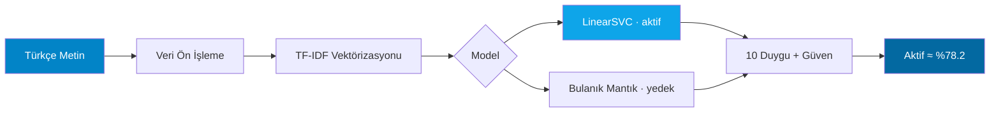
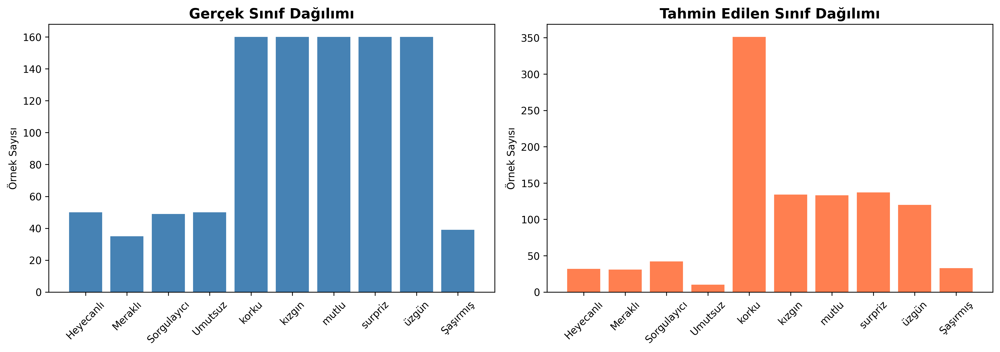
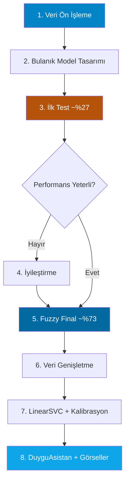
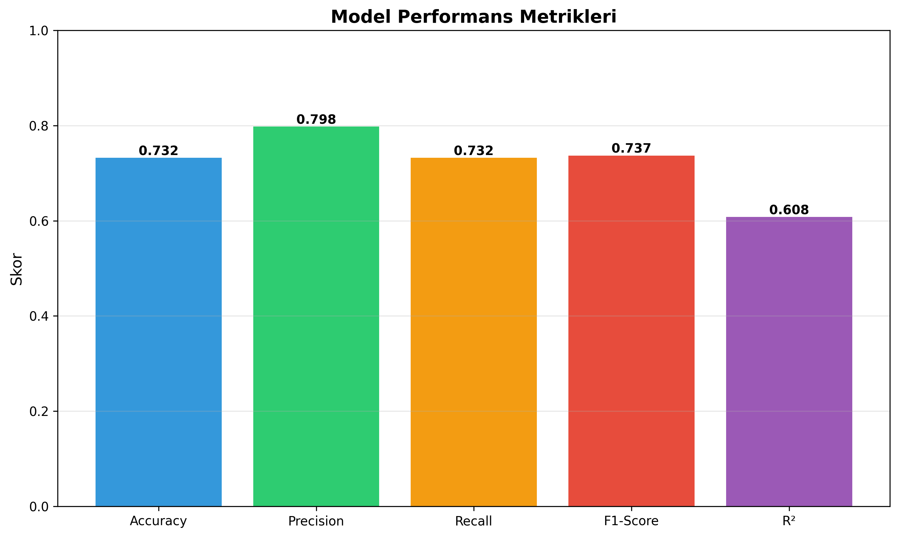
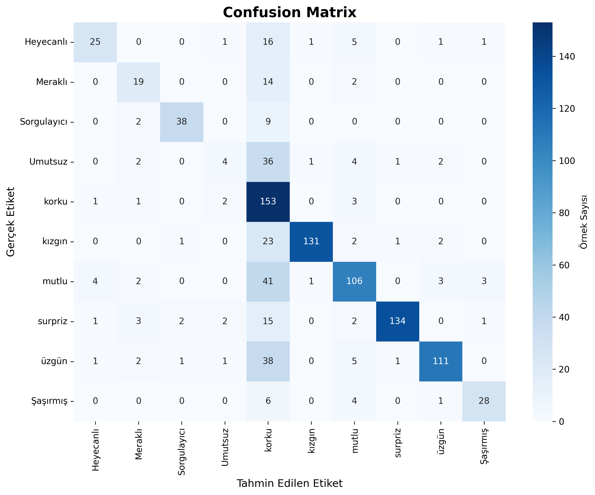
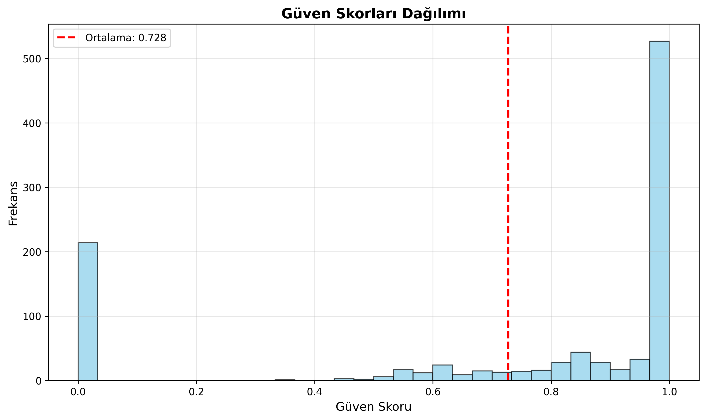
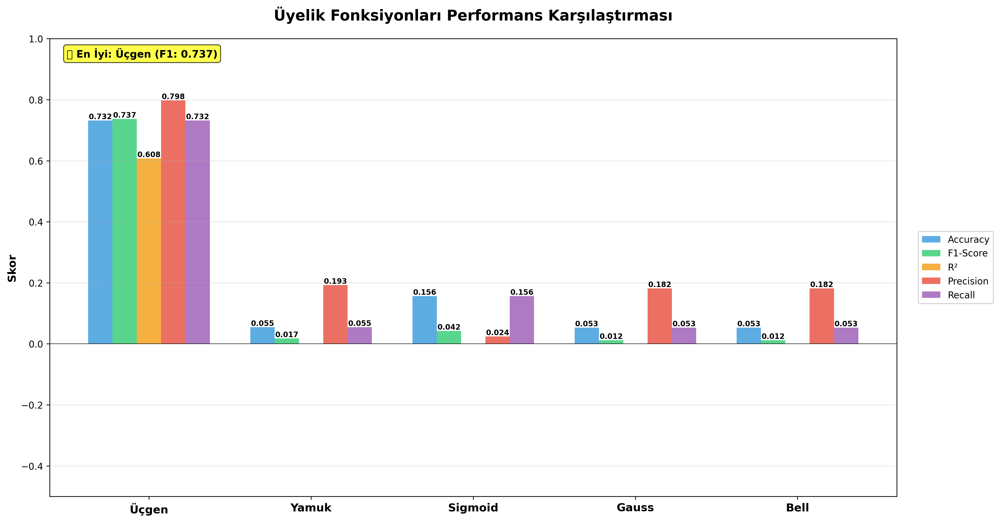

# 🧠 Bulanık Mantık ile Türkçe Tweet Duygu Analizi Sistemi

<div align="center">


**Bulanık Mantık + Makine Öğrenmesi ile 10 Sınıflı Türkçe Duygu Analizi**  
**DuyguAsistan arayüzü · genişletilmiş korpus · aktif doğruluk ≈ %78.2**

[✨ Özellikler](#-özellikler) • [📊 Veri Seti](#-veri-seti) • [📈 Performans](#-performans-metrikleri) • [🚀 Kurulum](#-kurulum-ve-kullanım) • [🎨 Görseller](#-görselleştirmeler) • [📚 Literatür](#-literatür-araştırması-ve-karşılaştırma)

</div>

---

## 📋 İçindekiler

1. [Proje Hakkında](#-proje-hakkında)
2. [Özellikler](#-özellikler)
3. [Veri Seti](#-veri-seti)
4. [Araştırma Süreci](#-araştırma-süreci)
5. [İlk Test Sonuçları](#-ilk-test-sonuçları)
6. [Model İyileştirme Süreci](#-model-iyileştirme-süreci)
7. [Performans Metrikleri](#-performans-metrikleri)
8. [Final Test Sonuçları (Bulanık Hattı)](#-final-test-sonuçları)
9. [Güncel Üretim Sonuçları (2026)](#-güncel-üretim-sonuçları-2026)
10. [Üyelik Fonksiyonları Karşılaştırması](#-üyelik-fonksiyonu-karşılaştırması)
11. [Teknik Mimari](#️-teknik-mimari)
12. [Teknik Detaylar](#-teknik-detaylar)
13. [Kurulum ve Yerel Çalıştırma](#-kurulum-ve-kullanım)
14. [DuyguAsistan Web Arayüzü](#-duyguasistan-web-arayüzü)
15. [Görselleştirmeler](#-görselleştirmeler)
16. [Proje Yapısı](#-proje-yapısı)
17. [Özet ve Sonuçlar](#-özet-ve-sonuçlar)
18. [Literatür Araştırması](#-literatür-araştırması-ve-karşılaştırma)
19. [Referanslar](#-referanslar)

---

## 📖 Proje Hakkında

Bu proje, Türkçe sosyal medya / kısa metinlerde **10 duygu sınıfını** tespit eden gelişmiş bir yapay zeka sistemidir.

İlk aşamada **Bulanık Mantık (Fuzzy Logic)** ile belirsizlik ve geçiş durumları modellendi; sistematik iyileştirmelerle bulanık hat **≈ %73.22** doğruluğa ulaştı. Sonrasında veri seti genişletildi ve üretimde **kalibre LinearSVC** aktif model olarak eklendi (**≈ %78.22** doğruluk). Bulanık model yorumlanabilirlik ve araştırma karşılaştırması için saklanır; arayüz adı **DuyguAsistan**’dır.

### 🎯 Proje Hedefleri


```mermaid
graph LR
    A[Türkçe Metin] --> B[Veri Ön İşleme]
    B --> C[TF-IDF Vektörizasyonu]
    C --> D{Model}
    D --> E[LinearSVC · aktif]
    D --> F[Bulanık Mantık · yedek]
    E --> G[10 Duygu + Güven]
    F --> G
    G --> H["Aktif ≈ %78.2"]

    style A fill:#0284c7,color:#fff
    style E fill:#0ea5e9,color:#fff
    style H fill:#0369a1,color:#fff
```

- ✅ Türkçe dil işleme için özelleştirilmiş ön işleme
- ✅ 5 farklı üyelik fonksiyonunun sistematik karşılaştırması
- ✅ 10 farklı duygu sınıfının yüksek doğrulukla tespiti
- ✅ Yorumlanabilir bulanık model + yüksek doğruluklu LinearSVC
- ✅ Genişletilmiş çok kaynaklı duygu korpusu
- ✅ DuyguAsistan: kullanıcı dostu Streamlit arayüzü

### 🎓 Araştırma Amacı

- Bulanık mantık sistemlerinin duygu analizi problemindeki etkinliğini araştırmak
- Farklı üyelik fonksiyonlarının performansını karşılaştırmak
- Türkçe doğal dil işleme için özelleştirilmiş bir çözüm sunmak
- Yorumlanabilir (interpretable) bir model geliştirmek
- Model performansını optimize etmek için sistematik iyileştirme süreci uygulamak
- Veri genişletmenin ve klasik ML (LinearSVC) eklemenin etkisini ölçmek
- Araştırma bulgularını anlaşılır bir web arayüzüyle sunmak

---

## ✨ Özellikler

<table>
<tr>
<td width="50%">

### 🎨 Teknik Özellikler

- **Çift model hattı**: LinearSVC (aktif) + Bulanık mantık (yedek)
- **Bulanık Mantık**: 5 üyelik fonksiyonu karşılaştırması
- **Gelişmiş Ön İşleme**: Türkçe stop-words, tokenization
- **TF-IDF**: 2500 özellik, (1,3) n-gram / trigram
- **Özellik Seçimi (fuzzy)**: Varyans + F-score
- **1,100+ Kural**: Otomatik kural çıkarımı + support faktörü
- **Kalibrasyon**: `CalibratedClassifierCV` ile anlamlı güven

</td>
<td width="50%">

### 🌟 Kullanıcı Özellikleri

- **DuyguAsistan**: Streamlit sohbet arayüzü
- **Gerçek Zamanlı Analiz**: Anında duygu + güven çubuğu
- **Türkçe teknik panel**: Doğruluk, F1, veri seti açıklamaları
- **Detaylı Raporlama**: Alternatif duygular ve olasılıklar
- **Görselleştirme**: Confusion matrix, metrik grafikleri
- **Örnek Metinler**: Hazır test cümleleri
- **Koyu deniz mavisi tema**: Net ve okunaklı arayüz

</td>
</tr>
</table>

---

## 📊 Veri Seti

### 📈 Genel Bilgiler

<div align="center">

| Özellik | Değer (güncel / 2026) |
|:--------|------:|
| **Kütüphane (korpus)** | **22.584** örnek |
| **Eğitim seti (curated)** | **10.973** (`TurkishTweets.xlsx`) |
| **Train / Test** | **8.778 / 2.195** (%80 / %20) |
| **Sınıf Sayısı** | 10 |
| **Dil** | Türkçe |
| **Aktif model** | `linear_svc_calibrated` |
| **TF-IDF boyut** | 2.500 |
| **Format** | Excel + CSV |

<details>
<summary><b>Klasik (genişletme öncesi) veri özeti — Aralık 2025 araştırması</b></summary>

| Özellik | Değer |
|:--------|------:|
| Toplam Tweet | 5.113 |
| Train / Test | 4.089 / 1.023 |
| Format | Excel (.xlsx) |

</details>

</div>

### 🎭 Duygu Sınıfları ve Dağılımı

```
┌─────────────────┬─────────┬──────────┬────────────────────────────┐
│ Duygu           │ Adet    │ Oran     │ Grafik                     │
├─────────────────┼─────────┼──────────┼────────────────────────────┤
│ 😠 kızgın       │ 800     │ 15.6%    │ ████████████████           │
│ 😨 korku        │ 800     │ 15.6%    │ ████████████████           │
│ 😊 mutlu        │ 800     │ 15.6%    │ ████████████████           │
│ 😲 surpriz      │ 800     │ 15.6%    │ ████████████████           │
│ 😢 üzgün        │ 800     │ 15.6%    │ ████████████████           │
│ 🎉 Heyecanlı    │ 250     │ 4.9%     │ █████                      │
│ 😔 Umutsuz      │ 249     │ 4.9%     │ █████                      │
│ 🤔 Sorgulayıcı  │ 244     │ 4.8%     │ █████                      │
│ 😯 Şaşırmış     │ 197     │ 3.9%     │ ████                       │
│ 🔍 Meraklı      │ 173     │ 3.4%     │ ███                        │
└─────────────────┴─────────┴──────────┴────────────────────────────┘
```

> ⚠️ **Not**: Veri seti dengesizdir (imbalanced). Ana duygular (kızgın, korku, mutlu, surpriz, üzgün) daha fazla temsil edilmektedir. Yukarıdaki ASCII tablo **klasik 5.113’lük set** dağılımını gösterir.

### 📚 Veri Kaynakları (2026 genişletmesi)

| Kaynak | Rol | Yaklaşık katkı |
|:-------|:----|---------------:|
| Orijinal `TurkishTweets` | 10 sınıflı temel set | ~5.015 |
| Hugging Face `nihalenc/turkish-8class-emotion-dataset` | Genişletme | ~17.569 |
| TRSAv1 | İndirildi; domain kayması nedeniyle final sete alınmadı | — |

Birleştirme betiği: `build_expanded_dataset.py` · Meta: `data/dataset_meta.txt`

### 📈 Güncel kütüphane dağılımı (22.584)

```
mutlu        ~4.060
kızgın       ~4.034
korku        ~3.846
üzgün        ~3.772
surpriz      ~3.276
Umutsuz      ~2.749
Heyecanlı      250
Sorgulayıcı    244
Şaşırmış       197
Meraklı        156
```

### 📈 Güncel eğitim seti (10.973 — kalite filtresi sonrası)

```
mutlu        1.913
kızgın       1.904
korku        1.831
üzgün        1.807
surpriz      1.622
Umutsuz      1.049
Heyecanlı      250
Sorgulayıcı    244
Şaşırmış       197
Meraklı        156
```



---

## 🔬 Araştırma Süreci

### 📋 Proje Aşamaları


```mermaid
graph TD
    A[1. Veri Ön İşleme] --> B[2. Bulanık Model Tasarımı]
    B --> C[3. İlk Test ~%27]
    C --> D{Performans Yeterli?}
    D -->|Hayır| E[4. İyileştirme]
    E --> F[5. Fuzzy Final ~%73]
    D -->|Evet| F
    F --> G[6. Veri Genişletme]
    G --> H[7. LinearSVC + Kalibrasyon]
    H --> I[8. DuyguAsistan + Görseller]
    
    style A fill:#0284c7,color:#fff
    style C fill:#b45309,color:#fff
    style F fill:#0369a1,color:#fff
    style I fill:#0ea5e9,color:#fff
```

---

## 📉 İlk Test Sonuçları

### İlk Model Konfigürasyonu

- **Özellik Sayısı**: 50
- **TF-IDF Özellikleri**: 500
- **N-gram Aralığı**: (1, 2) - Unigram ve Bigram
- **Kural Başına Özellik**: 3
- **Özellik Seçimi**: Sadece varyans bazlı
- **Minimum Üyelik Eşiği**: Yok

### İlk Test Performans Metrikleri

| Metrik | Değer | Yorum |
|--------|-------|-------|
| **Accuracy** | 26.88% | ❌ Çok düşük |
| **F1-Score** | 0.2182 | ❌ Yetersiz |
| **R²** | 0.0066 | ❌ Neredeyse sıfır |
| **Precision** | 0.5238 | ⚠️ Orta |
| **Recall** | 0.2688 | ❌ Düşük |
| **Ortalama Güven** | 0.2907 | ❌ Düşük güven |

### İlk Test - Üyelik Fonksiyonu Karşılaştırması

| Üyelik Fonksiyonu | Accuracy | F1-Score | R² | Precision | Recall | En İyi? |
|-------------------|----------|----------|-----|-----------|--------|---------|
| **Üçgen** | 18.77% | 0.0978 | -0.0369 | 0.5000 | 0.1877 | ❌ |
| **Yamuk** | 16.91% | 0.0617 | -0.1926 | 0.0553 | 0.1691 | ❌ |
| **Sigmoid** | 18.18% | 0.0846 | -0.0083 | 0.0659 | 0.1818 | ❌ |
| **Gauss** | HATA | - | - | - | - | ❌ |
| **Bell** ⭐ | 26.88% | 0.2182 | 0.0066 | 0.5238 | 0.2688 | ✅ |

**Sonuç**: Bell üyelik fonksiyonu en iyi performansı gösterdi ancak genel performans kabul edilebilir seviyenin çok altındaydı.

### İlk Test - Sınıf Bazlı Performans (Bell Fonksiyonu)

| Duygu | Precision | Recall | F1-Score | Durum |
|-------|-----------|--------|----------|-------|
| Heyecanlı | 0.00 | 0.00 | 0.00 | ❌ Hiç tahmin edilemedi |
| Meraklı | 0.55 | 0.34 | 0.42 | ⚠️ Orta |
| Sorgulayıcı | 1.00 | 0.12 | 0.22 | ⚠️ Düşük recall |
| Umutsuz | 0.00 | 0.00 | 0.00 | ❌ Hiç tahmin edilemedi |
| korku | 0.60 | 0.44 | 0.51 | ⚠️ Orta |
| kızgın | 0.17 | 0.88 | 0.29 | ⚠️ Düşük precision |
| mutlu | 0.75 | 0.26 | 0.39 | ⚠️ Düşük recall |
| surpriz | 1.00 | 0.01 | 0.02 | ❌ Çok düşük recall |
| üzgün | 0.40 | 0.01 | 0.02 | ❌ Çok düşük recall |
| Şaşırmış | 0.00 | 0.00 | 0.00 | ❌ Hiç tahmin edilemedi |

**Tespit Edilen Sorunlar:**
1. ❌ Çok düşük genel performans (%26.88 accuracy)
2. ❌ Birçok sınıf hiç tahmin edilemedi (Heyecanlı, Umutsuz, Şaşırmış)
3. ❌ Düşük recall değerleri (birçok sınıf için %1-12 arası)
4. ❌ R² değeri neredeyse sıfır (model veriyi açıklamıyor)
5. ❌ Düşük güven skorları (ortalama %29)

---

## 🚀 Model İyileştirme Süreci

### 🚀 İyileştirme Stratejisi

Performansı artırmak için sistematik bir iyileştirme süreci uygulandı. Her iyileştirme adımı test edildi ve sonuçları değerlendirildi.

<table>
<tr>
<th width="30%">Parametre</th>
<th width="25%">İlk Değer</th>
<th width="25%">Final Değer</th>
<th width="20%">İyileştirme</th>
</tr>

<tr>
<td>🎯 Özellik Sayısı</td>
<td align="center">50</td>
<td align="center"><b>150</b></td>
<td align="center"><span style="color: green">↑ 3x</span></td>
</tr>

<tr>
<td>📝 TF-IDF Özellik</td>
<td align="center">500</td>
<td align="center"><b>1000</b></td>
<td align="center"><span style="color: green">↑ 2x</span></td>
</tr>

<tr>
<td>🔤 N-gram Aralığı</td>
<td align="center">(1, 2)</td>
<td align="center"><b>(1, 3)</b></td>
<td align="center"><span style="color: green">+ Trigram</span></td>
</tr>

<tr>
<td>📊 Kural/Özellik</td>
<td align="center">3</td>
<td align="center"><b>5</b></td>
<td align="center"><span style="color: green">↑ 67%</span></td>
</tr>

<tr>
<td>🎚️ Min Üyelik Eşiği</td>
<td align="center">Yok</td>
<td align="center"><b>0.15</b></td>
<td align="center"><span style="color: green">✓ Eklendi</span></td>
</tr>

<tr>
<td>⚖️ Support Faktörü</td>
<td align="center">Yok</td>
<td align="center"><b>Aktif</b></td>
<td align="center"><span style="color: green">✓ Eklendi</span></td>
</tr>

<tr>
<td>🎯 Min Güven Eşiği</td>
<td align="center">Yok</td>
<td align="center"><b>30%</b></td>
<td align="center"><span style="color: green">✓ Eklendi</span></td>
</tr>

<tr>
<td>🔍 Özellik Seçimi</td>
<td align="center">Varyans</td>
<td align="center"><b>Varyans+F-score</b></td>
<td align="center"><span style="color: green">✓ İyileştirildi</span></td>
</tr>

</table>

### İyileştirme Adımları

#### 1️⃣ Özellik Sayısını Artırma

**Değişiklik:**
- Önceki: 50 özellik
- Yeni: **150 özellik** (3x artış)

**Gerekçe:** Daha fazla özellik, modelin daha fazla bilgi kullanmasını sağlar ve daha iyi sınıflandırma yapabilir.

#### 2️⃣ TF-IDF Özellik Sayısını Artırma

**Değişiklik:**
- Önceki: 500 özellik
- Yeni: **1000 özellik** (2x artış)

**Gerekçe:** Daha fazla kelime ve kelime kombinasyonu, duygu analizi için daha zengin özellik seti sağlar.

#### 3️⃣ N-gram Aralığını Genişletme

**Değişiklik:**
- Önceki: (1, 2) - Unigram ve Bigram
- Yeni: **(1, 3) - Unigram, Bigram ve Trigram**

**Gerekçe:** Trigram'lar, cümle bağlamını daha iyi yakalar ve Türkçe'deki kelime kombinasyonlarını daha iyi modeller.

#### 4️⃣ TF-IDF Parametrelerini Optimize Etme

**Değişiklik:**
- `sublinear_tf=True` eklendi (log scaling)
- `max_df=0.90` (daha seçici)

**Gerekçe:** Log scaling, sık geçen kelimelerin aşırı ağırlıklandırılmasını önler.

#### 5️⃣ Özellik Seçimini İyileştirme

**Değişiklik:**
- Önceki: Sadece varyans bazlı seçim
- Yeni: **Varyans + F-score kombinasyonu**

**Gerekçe:** F-score, sınıflar arası ayrımı ölçer. Varyans ile kombinasyonu, hem bilgi içeriği hem de sınıf ayrımı sağlayan özellikleri seçer.

#### 6️⃣ Kural Başına Özellik Sayısını Artırma

**Değişiklik:**
- Önceki: 3 özellik/kural
- Yeni: **5 özellik/kural**

**Gerekçe:** Daha fazla özellik kombinasyonu, daha karmaşık ve doğru kurallar oluşturur.

#### 7️⃣ Minimum Üyelik Eşiği Ekleme

**Değişiklik:**
- Önceki: Eşik yok
- Yeni: **0.15 minimum üyelik eşiği**

**Gerekçe:** Düşük üyelik dereceli kurallar gürültü yaratır. Eşik, sadece güçlü kuralları kullanır.

#### 8️⃣ Kural Birleştirme Stratejisini İyileştirme

**Değişiklik:**
- **Support faktörü** eklendi
- Daha fazla örnekte görülen kurallar daha yüksek ağırlık alır
- **Minimum güven eşiği**: %30

**Gerekçe:** Support faktörü, daha güvenilir kuralları ön plana çıkarır. Minimum güven eşiği, zayıf kuralları filtreler.

### 📊 İyileştirme Sonuçları

---

## 📊 Performans Metrikleri

### 🏆 Final Model Sonuçları (Bulanık üçgen — araştırma finali)

> Bu tablo **genişletme öncesi / bulanık hat** finalidir. Güncel üretim metrikleri için aşağıdaki **2026** bölümüne bakın.

<div align="center">

| Metrik | Değer | Durum |
|:------:|:-----:|:-----:|
| **Accuracy** | 73.22% | 🟢 Çok İyi |
| **F1-Score** | 0.7370 | 🟢 Çok İyi |
| **R² Skoru** | 0.6077 | 🟢 İyi |
| **Precision** | 0.7978 | 🟢 Çok İyi |
| **Recall** | 0.7322 | 🟢 Çok İyi |
| **Ortalama Güven** | 72.77% | 🟢 Yüksek |

</div>

### 📈 Performans İyileştirme Grafiği

```
İLK TEST                              FİNAL TEST
─────────────────────────────────────────────────────
Accuracy:     26.88%  ████▌          73.22%  ███████████████
F1-Score:     0.2182  ███▊           0.7370  ███████████████
R²:           0.0066  ▏              0.6077  ████████████▌
Precision:    0.5238  ██████████▌    0.7978  ████████████████
Recall:       0.2688  ████▌          0.7322  ███████████████

İYİLEŞTİRME ORANI: 2.7x - 92x arası! 🚀
```

## 📊 Final Test Sonuçları

### Final Model Konfigürasyonu

- **Özellik Sayısı**: 150
- **TF-IDF Özellikleri**: 1000
- **N-gram Aralığı**: (1, 3) - Unigram, Bigram, Trigram
- **Kural Başına Özellik**: 5
- **Özellik Seçimi**: Varyans + F-score kombinasyonu
- **Minimum Üyelik Eşiği**: 0.15
- **Support Faktörü**: Aktif
- **Minimum Güven Eşiği**: %30

### Performans Karşılaştırması

<div align="center">

| Metrik | İlk Test | Final Test | İyileştirme | Oran |
|:-------|:--------:|:----------:|:-----------:|:----:|
| **Accuracy** | 26.88% | **73.22%** | +46.34% | 🚀 **2.7x** |
| **F1-Score** | 0.2182 | **0.7370** | +0.5188 | 🚀 **3.4x** |
| **R²** | 0.0066 | **0.6077** | +0.6011 | 🚀 **92x** |
| **Precision** | 0.5238 | **0.7978** | +0.2740 | 🚀 **1.5x** |
| **Recall** | 0.2688 | **0.7322** | +0.4634 | 🚀 **2.7x** |
| **Güven** | 29.07% | **72.77%** | +43.70% | 🚀 **2.5x** |

</div>

### Final Test - Üyelik Fonksiyonu Karşılaştırması

| Üyelik Fonksiyonu | Accuracy | F1-Score | R² | Precision | Recall | Ortalama Güven | En İyi? |
|-------------------|----------|----------|-----|-----------|--------|----------------|---------|
| **Üçgen** ⭐ | **73.22%** | **0.7370** | **0.6077** | **0.7978** | **0.7322** | **0.7277** | ✅ |
| **Yamuk** | 5.47% | 0.0174 | -0.4433 | 0.1929 | 0.0547 | 0.5630 | ❌ |
| **Sigmoid** | 15.64% | 0.0423 | -0.0032 | 0.0245 | 0.1564 | 0.1830 | ❌ |
| **Gauss** | 5.28% | 0.0120 | -0.4191 | 0.1816 | 0.0528 | 0.5488 | ❌ |
| **Bell** | 5.28% | 0.0120 | -0.1968 | 0.1816 | 0.0528 | 0.4087 | ❌ |

**Sonuç**: İyileştirmelerden sonra **Üçgen (Triangular)** üyelik fonksiyonu en iyi performansı gösterdi.

### 🎯 Sınıf Bazlı Performans

<details>
<summary><b>Tıklayarak Detayları Görüntüle</b></summary>

| Duygu | Precision | Recall | F1-Score | Durum |
|:------|:---------:|:------:|:--------:|:-----:|
| 😠 **kızgın** | 0.98 | 0.82 | **0.89** | ⭐⭐⭐ Mükemmel |
| 😲 **surpriz** | 0.98 | 0.84 | **0.90** | ⭐⭐⭐ Mükemmel |
| 😢 **üzgün** | 0.93 | 0.69 | **0.79** | ⭐⭐ Çok İyi |
| 🤔 **Sorgulayıcı** | 0.90 | 0.78 | **0.84** | ⭐⭐ Çok İyi |
| 😯 **Şaşırmış** | 0.85 | 0.72 | **0.78** | ⭐⭐ İyi |
| 😊 **mutlu** | 0.80 | 0.66 | **0.72** | ⭐⭐ İyi |
| 🎉 **Heyecanlı** | 0.78 | 0.50 | **0.61** | ⭐ Orta |
| 😨 **korku** | 0.44 | 0.96 | **0.60** | ⚠️ Yüksek Recall |
| 🔍 **Meraklı** | 0.61 | 0.54 | **0.58** | ⭐ Orta |
| 😔 **Umutsuz** | 0.40 | 0.08 | **0.13** | ⚠️ Geliştirilebilir |

</details>

**Gözlemler:**
- ✅ **surpriz** ve **kızgın** sınıfları en iyi performansı gösterdi (F1 > 0.89)
- ✅ Çoğu sınıf için F1-score > 0.70 (iyi seviye)
- ⚠️ **korku** sınıfında yüksek recall (%96) ama düşük precision (%44) - fazla tahmin yapılıyor
- ❌ **Umutsuz** sınıfı hala düşük performans gösteriyor (F1 = 0.13)

### Kural İstatistikleri

- **Toplam Kural Sayısı**: 1,100
- **Aktif Kural Sayısı**: 1,100 (tümü kullanılıyor)
- **Ortalama Kural Güveni**: 0.7277 (%72.77)
- **En Yüksek Kural Güveni**: ~0.98
- **En Düşük Kural Güveni**: 0.30 (minimum eşik)

---

## 🚀 Güncel Üretim Sonuçları (2026)

Veri genişletmesi ve **LinearSVC + kalibrasyon** eklenmesi sonrası aktif üretim sonuçları (`evaluation_report.csv`):

<div align="center">

| Metrik | LinearSVC (aktif) | Fuzzy üçgen (yedek) |
|:------:|:-----------------:|:-------------------:|
| **Accuracy** | **78.22%** | 53.94% |
| **F1-Score** | **0.7815** | 0.5574 |
| **Precision** | **0.7826** | 0.6754 |
| **Recall** | **0.7822** | 0.5394 |
| **R²** | **0.6413** | 0.2336 |
| **Ortalama Güven** | **70.75%** | 59.57% |
| **Eğitim / Test** | 8.778 / 2.195 | aynı ayrım |
| **Özellik (TF-IDF)** | 2.500 | fuzzy içinde ≈150 seçili |

</div>

### Neden çift model?

| Model | Güçlü yön | Zayıf yön | Kullanım |
|:------|:----------|:----------|:---------|
| **LinearSVC (kalibre)** | Yüksek doğruluk, hızlı çıkarım | Daha az “kural dili” | **Aktif arayüz modeli** |
| **Bulanık üçgen** | Yorumlanabilir kurallar, araştırma değeri | Büyük korpusta doğruluk daha düşük | Karşılaştırma / yedek |

`app.py` önce `best_sklearn_model.pkl` yükler; yoksa bulanık modele düşer.







### Güncel model karşılaştırma dosyası

`membership_function_comparison.csv`:

| Model | Accuracy | F1 | R² | Güven |
|:------|:--------:|:--:|:--:|:-----:|
| fuzzy_triangular | 53.94% | 0.557 | 0.234 | 0.596 |
| **linear_svc_calibrated** | **78.22%** | **0.781** | **0.641** | **0.708** |



---

## 🎨 Üyelik Fonksiyonu Karşılaştırması

### 📊 Detaylı Performans Tablosu

| Fonksiyon | Accuracy | F1-Score | R² | Kural Sayısı | Durum |
|:----------|:--------:|:--------:|:--:|:------------:|:-----:|
| **🔺 Üçgen** | **73.22%** | **0.7370** | **0.6077** | 1,100 | ⭐ **EN İYİ** |
| 📐 Yamuk | 5.47% | 0.0174 | -0.4433 | 17 | ❌ Yetersiz |
| 📈 Sigmoid | 15.64% | 0.0423 | -0.0032 | 1,117 | ❌ Düşük |
| 🔔 Gauss | 5.28% | 0.0120 | -0.4191 | 63 | ❌ Yetersiz |
| 🛎️ Bell | 5.28% | 0.0120 | -0.1968 | 78 | ❌ Yetersiz |

### 🏆 Neden Üçgen Üyelik Fonksiyonu?

<table>
<tr>
<td width="50%">

#### ✅ Avantajlar

- **Basit ve Hızlı**: Hesaplama karmaşıklığı düşük
- **Net Geçişler**: Sınıflar arası ayrımı iyi yapar
- **Kapsamlı Model**: 1,100 kural ile zengin
- **Yüksek Güven**: %72.77 ortalama güven skoru
- **Bu Veri Setine Uygun**: Özellik dağılımlarına iyi uyum

</td>
<td width="50%">

#### 📉 Diğer Fonksiyonların Sorunları

- **Yamuk**: Çok az kural (17), yetersiz öğrenme
- **Sigmoid**: Yumuşak geçişler, düşük ayrım
- **Gauss**: Asimetrik dağılımlara uyumsuz
- **Bell**: Parametre optimizasyonu eksik
- **Genel**: Negatif R² değerleri

</td>
</tr>
</table>


---

## 🛠️ Teknik Mimari

### 🔄 Sistem Akış Diyagramı

```
┌─────────────────────────────────────────────────────────────┐
│                    1. VERİ ÖN İŞLEME                        │
│  ┌────────────┐  ┌────────────┐  ┌────────────┐             │
│  │ Temizleme  │→ │ Stop Words │→ │Tokenization│             │
│  │(URL,@,#)   │  │ Kaldırma   │  │            │             │
│  └────────────┘  └────────────┘  └────────────┘              │  
└────────────────────────────┬────────────────────────────────┘
                             ▼
┌─────────────────────────────────────────────────────────────┐
│                2. TF-IDF VEKTÖRİZASYONU                      │
│  • N-gram: (1,3) - Unigram, Bigram, Trigram                │
│  • Max Features: 1000                                        │
│  • Sublinear TF Scaling: Aktif                              │
│  • Min DF: 2, Max DF: 0.90                                  │
│                                                             │
│              [1000 Boyutlu Özellik Vektörü]                 │
└────────────────────────────┬────────────────────────────────┘
                             ▼
┌─────────────────────────────────────────────────────────────┐
│           3. ÖZELLİK SEÇİMİ (Top 150 Özellik)               │
│  • Varyans Analizi + F-Score (Sınıf Ayrımı)                │
│  • Kombine Skor: Varyans × (1 + F-Score)                   │
│  • En İyi 150 Özellik Seçimi                                │
└────────────────────────────┬────────────────────────────────┘
                             ▼
┌─────────────────────────────────────────────────────────────┐
│                    4. BULANIKLAŞTIRMA                        │
│  Her Özellik İçin:                                          │
│    ├─ Üçgen Üyelik Fonksiyonu                              │
│    ├─ 3 Bulanık Küme: Düşük, Orta, Yüksek                 │
│    ├─ Minimum Üyelik Eşiği: 0.15                           │
│    └─ Üyelik Dereceleri Hesaplama                          │
└────────────────────────────┬────────────────────────────────┘
                             ▼
┌─────────────────────────────────────────────────────────────┐
│           5. KURAL ÇIKARIMI (1,100 Kural)                   │
│  • Her Eğitim Örneği → Kural Oluşturma                     │
│  • En Yüksek Üyelik Dereceli 5 Özellik                     │
│  • Benzer Kuralları Birleştirme                             │
│  • Support Faktörü ile Ağırlıklandırma                      │
│  • Minimum Güven Eşiği: %30                                 │
└────────────────────────────┬────────────────────────────────┘
                             ▼
┌─────────────────────────────────────────────────────────────┐
│              6. ÇIKARIM VE TAHMİN                           │
│  Yeni Metin:                                                │
│    ├─ Ön İşleme → TF-IDF → Özellik Seçimi                 │
│    ├─ Bulanıklaştırma                                      │
│    ├─ Kural Eşleştirme (Support ile ağırlıklı)            │
│    ├─ Sınıf Skorları Toplama                               │
│    └─ En Yüksek Skorlu Sınıf Seçimi                        │
└────────────────────────────┬────────────────────────────────┘
                             ▼
                    ┌─────────────────┐
                    │  10 Duygu Sınıfı │
                    │ Aktif ≈ %78.2   │
                    └─────────────────┘
```

## 🔬 Teknik Detaylar

### Algoritma Akışı

```
┌─────────────────────────────────────────────────────────────────────────┐
│              VERİ: kütüphane 22.584 · eğitim 10.973 · 10 sınıf          │
│                   10 Duygu Sınıfı: mutlu, üzgün, korku, ...            │
└────────────────────────────────────┬────────────────────────────────────┘
                                     │
                                     ▼
┌─────────────────────────────────────────────────────────────────────────┐
│                        VERİ ÖN İŞLEME                                   │
│  ┌──────────────┐  ┌──────────────┐  ┌──────────────┐                │
│  │ Metin        │  │ Stop Words   │  │ Tokenization │                │
│  │ Temizleme    │→ │ Kaldırma     │→ │              │                │
│  │ (URL, @, #)  │  │ (Türkçe)     │  │              │                │
│  └──────────────┘  └──────────────┘  └──────────────┘                │
└────────────────────────────────────┬────────────────────────────────────┘
                                     │
                                     ▼
┌─────────────────────────────────────────────────────────────────────────┐
│                    TF-IDF VEKTÖRİZASYONU                                 │
│  ┌──────────────────────────────────────────────────────┐              │
│  │ • N-gram: (1, 3) - Unigram, Bigram, Trigram         │              │
│  │ • Max Features: 2500 (güncel) / 1000 (fuzzy araş.)   │              │
│  │ • Sublinear TF Scaling: Aktif                       │              │
│  │ • Min DF: 2, Max DF: 0.90                           │              │
│  └──────────────────────────────────────────────────────┘              │
│                          ↓                                             │
│              [1000 Boyutlu Özellik Vektörü]                            │
└────────────────────────────────────┬────────────────────────────────────┘
                                     │
                                     ▼
┌─────────────────────────────────────────────────────────────────────────┐
│                      ÖZELLİK SEÇİMİ (150 Özellik)                       │
│  ┌──────────────────────────────────────────────────────┐              │
│  │ • Varyans Analizi                                    │              │
│  │ • F-Score (Sınıf Ayrımı)                             │              │
│  │ • Kombine Skor: Varyans × (1 + F-Score)              │              │
│  │ • En İyi 150 Özellik Seçildi                         │              │
│  └──────────────────────────────────────────────────────┘              │
└────────────────────────────────────┬────────────────────────────────────┘
                                     │
                                     ▼
┌─────────────────────────────────────────────────────────────────────────┐
│                      BULANIKLAŞTIRMA                                     │
│  ┌──────────────────────────────────────────────────────┐              │
│  │ Her Özellik İçin:                                    │              │
│  │   • Üçgen Üyelik Fonksiyonu                         │              │
│  │   • 3 Bulanık Küme: Düşük, Orta, Yüksek             │              │
│  │   • Minimum Üyelik Eşiği: 0.15                       │              │
│  │   • Üyelik Dereceleri Hesaplanır                     │              │
│  └──────────────────────────────────────────────────────┘              │
│                          ↓                                             │
│         [Her Özellik → Bulanık Küme Üyelik Dereceleri]                 │
└────────────────────────────────────┬────────────────────────────────────┘
                                     │
                                     ▼
┌─────────────────────────────────────────────────────────────────────────┐
│                      KURAL ÇIKARIMI                                     │
│  ┌──────────────────────────────────────────────────────┐              │
│  │ • Her Eğitim Örneği İçin:                            │              │
│  │   - En Yüksek Üyelik Dereceli 5 Özellik Seçilir     │              │
│  │   - Kural Oluşturulur:                              │              │
│  │     EĞER feat1=set1 VE feat2=set2 ... İSE label     │              │
│  │                                                      │              │
│  │ • Kural Birleştirme:                                │              │
│  │   - Benzer Kurallar Birleştirilir                   │              │
│  │   - Support Faktörü ile Ağırlıklandırılır           │              │
│  │   - Minimum Güven Eşiği: %30                        │              │
│  └──────────────────────────────────────────────────────┘              │
│                          ↓                                             │
│                    [1,100 Kural Oluşturuldu]                            │
└────────────────────────────────────┬────────────────────────────────────┘
                                     │
                                     ▼
┌─────────────────────────────────────────────────────────────────────────┐
│                      MODEL EĞİTİMİ                                     │
│  ┌──────────────────────────────────────────────────────┐              │
│  │ • Train/Test Split: 80/20                            │              │
│  │ • Train Seti: 8,778 örnek (güncel)                   │              │
│  │ • Test Seti: 2,195 örnek (güncel)                    │              │
│  │ • 5 Üyelik Fonksiyonu Test Edildi                    │              │
│  │ • En İyi: Üçgen (Triangular)                         │              │
│  └──────────────────────────────────────────────────────┘              │
└────────────────────────────────────┬────────────────────────────────────┘
                                     │
                                     ▼
┌─────────────────────────────────────────────────────────────────────────┐
│                      TAHMİN (ÇIKARIM)                                   │
│  ┌──────────────────────────────────────────────────────┐              │
│  │ Yeni Metin İçin:                                     │              │
│  │   1. Ön İşleme → TF-IDF → Özellik Seçimi            │              │
│  │   2. Bulanıklaştırma (Üyelik Dereceleri)            │              │
│  │   3. Kural Eşleştirme:                               │              │
│  │      - Her kural için uygunluk derecesi              │              │
│  │      - Support faktörü ile ağırlıklandırma          │              │
│  │   4. Sınıf Skorları Toplanır                         │              │
│  │   5. En Yüksek Skorlu Sınıf Seçilir                 │              │
│  └──────────────────────────────────────────────────────┘              │
└────────────────────────────────────┬────────────────────────────────────┘
                                     │
                                     ▼
┌─────────────────────────────────────────────────────────────────────────┐
│                      DEĞERLENDİRME                                      │
│  ┌──────────────────────────────────────────────────────┐              │
│  │ Metrikler:                                           │              │
│  │   • Accuracy: 78.22% (aktif SVC)                     │              │
│  │   • F1-Score: 0.7815 (aktif)                        │              │
│  │   • R²: 0.6413 (aktif)                              │              │
│  │   • Precision: 0.7826 (aktif)                       │              │
│  │   • Recall: 0.7822 (aktif)                          │              │
│  │   • Ortalama Güven: 0.7075 (aktif)                  │              │
│  │                                                      │              │
│  │ Görselleştirmeler:                                   │              │
│  │   • Confusion Matrix                                 │              │
│  │   • Sınıf Dağılımı                                   │              │
│  │   • Güven Skorları                                   │              │
│  └──────────────────────────────────────────────────────┘              │
└─────────────────────────────────────────────────────────────────────────┘
```

### 💡 R² (Determinasyon Katsayısı) Açıklaması

R² değeri, modelin veriyi ne kadar iyi açıkladığını gösteren bir metriktir:

| R² Aralığı | Performans | Açıklama |
|:----------:|:----------:|:---------|
| **0.75 - 1.0** | 🟢 Mükemmel | Model veriyi çok iyi açıklıyor |
| **0.50 - 0.75** | 🟢 İyi | Model veriyi iyi açıklıyor |
| **0.25 - 0.50** | 🟡 Orta | Model kısmen açıklayabiliyor |
| **0.0 - 0.25** | 🔴 Zayıf | Model veriyi zayıf açıklıyor |
| **< 0.0** | 🔴 Yetersiz | Model ortalamanın altında |

**Bulanık final**: R² = **0.6077** → 🟢 İyi  
**Aktif LinearSVC (2026)**: R² = **0.6413** → 🟢 İyi  
- Aktif model veriyi **≈ %64 oranında** açıklayabiliyor
- Duygu analizi için **çok iyi** bir sonuç

---

## 🚀 Kurulum ve Kullanım

### 📋 Gereksinimler

- **Python**: 3.8 veya üzeri (önerilen 3.10 / 3.11 / 3.13)
- **RAM**: Minimum 4GB (eğitimde önerilen 8GB+)
- **Disk Alanı**: ~1GB (veri + modeller + sanal ortam)
- **İşletim Sistemi**: Windows, Linux, macOS

### ⚙️ Kurulum Adımları (yerel)

```bash
# 1) Repository'yi klonlayın
git clone https://github.com/<kullanici>/TurkceDuyguAnalizi.git
cd TurkceDuyguAnalizi
# Klasör adınız TurkceDuyguAnalizi-main ise:
# cd TurkceDuyguAnalizi-main

# 2) Sanal ortam oluşturun (önerilen)
python -m venv .venv

# 3) Sanal ortamı aktifleştirin
# Windows PowerShell:
.\.venv\Scripts\Activate.ps1
# Windows CMD:
# .venv\Scripts\activate.bat
# Linux / macOS:
# source .venv/bin/activate

# 4) Gerekli kütüphaneleri yükleyin
pip install --upgrade pip
pip install -r requirements.txt
```

`requirements.txt` özeti: `pandas`, `numpy`, `scikit-learn`, `scikit-fuzzy`, `nltk`, `streamlit`, `openpyxl`, `matplotlib`, `seaborn`, `joblib`.

### 🎯 Kullanım

#### 0️⃣ (İsteğe bağlı) Veri setini yeniden üretme

Hazır `TurkishTweets.xlsx` ve `data/turkish_emotion_corpus.csv` varsa atlayabilirsiniz.

```bash
python build_expanded_dataset.py
```

#### 1️⃣ Model Eğitimi

```bash
python train_model.py
```

**Çıktı**:
- ✅ `best_sklearn_model.pkl` — Aktif üretim modeli (LinearSVC + kalibrasyon)
- ✅ `best_fuzzy_model.pkl` — Bulanık yedek / araştırma modeli
- ✅ `preprocessing_artifacts.pkl` — TF-IDF ve label encoder
- ✅ `membership_function_comparison.csv` — Karşılaştırma sonuçları
- ✅ `evaluation_report.csv` — Eğitim sonu özet metrikler

#### 2️⃣ Model Değerlendirme

```bash
python evaluate_model.py
```

İsteğe bağlı karşılaştırma görseli:

```bash
python create_membership_comparison.py
```

**Çıktı**:
- ✅ `evaluation_report.csv` — Detaylı metrikler
- ✅ `Gorseller/confusion_matrix.png`
- ✅ `Gorseller/class_distribution.png`
- ✅ `Gorseller/confidence_distribution.png`
- ✅ `Gorseller/metrics_comparison.png`
- ✅ `Gorseller/membership_function_comparison.png`

#### 3️⃣ Web Arayüzü (DuyguAsistan)

```bash
streamlit run app.py
```

**Tarayıcınızda**: [http://localhost:8501](http://localhost:8501)

Port doluysa:

```bash
streamlit run app.py --server.port 8502
```

Tema: `.streamlit/config.toml` (koyu deniz mavisi).

### ✅ Hızlı kontrol listesi

- [ ] `.venv` aktif mi?
- [ ] `pip install -r requirements.txt` tamam mı?
- [ ] `preprocessing_artifacts.pkl` var mı?
- [ ] `best_sklearn_model.pkl` veya `best_fuzzy_model.pkl` var mı?
- [ ] `streamlit run app.py` sonrası 8501 açılıyor mu?

### 🛠️ Sık karşılaşılan sorunlar

| Sorun | Çözüm |
|:------|:------|
| Model yüklenemedi | Önce `python train_model.py` |
| Port 8501 dolu | `--server.port 8502` kullanın |
| Türkçe karakter bozuk | Dosyaların UTF-8 olduğundan emin olun |
| NLTK / stopword hatası | İnternet açıkken bir kez ön işlemeyi çalıştırın |
| Excel okunamıyor | `openpyxl` kurulu mu kontrol edin |

---

## 💬 DuyguAsistan Web Arayüzü

`app.py` sohbet benzeri bir deneyim sunar:

1. Aşağıdaki kutuya Türkçe cümle yazın veya örneklerden birine tıklayın
2. Model duyguyu, güven yüzdesini ve alternatif duyguları gösterir
3. Sol **Proje Paneli**nde doğruluk, veri seti, pipeline ve görseller Türkçe açıklanır

Örnek:

```text
Bugün çok mutlu bir gün geçirdim!
→ mutlu · yüksek güven
```

Arayüz özellikleri:
- Koyu mavi / beyaz / deniz mavisi palet
- Görünür sidebar aç/kapa kontrolü
- Teknik terimlerin Türkçe karşılıkları (Doğruluk, Kesinlik, Duyarlılık, F1, R², Ort. güven)

---
## 🎨 Görselleştirmeler

### 📊 1. Confusion Matrix

Modelin hangi sınıfları doğru/yanlış tahmin ettiğini gösterir:

```
         Tahmin Edilen
         ┌─────────────────────────────────┐
Gerçek   │ Koyu Renkler = Doğru Tahmin ✅  │
Etiket   │ Açık Renkler = Yanlış Tahmin ❌ │
         └─────────────────────────────────┘
```

**Dosya:** `Gorseller/confusion_matrix.png`


### 📈 2. Sınıf Dağılımı

Gerçek vs Tahmin edilen sınıf dağılımlarını karşılaştırır.

**Dosya:** `Gorseller/class_distribution.png`


### 📉 3. Güven Skorları

Modelin tahminlerindeki güven seviyelerini gösterir.
- **Ortalama (aktif model)**: ≈ %70.75
- **Dağılım**: Çoğu tahmin yüksek güvenle yapılıyor ✅

**Dosya:** `Gorseller/confidence_distribution.png`


### 📊 4. Metrik Karşılaştırması

Tüm performans metriklerini bar grafikte gösterir.

**Dosya:** `Gorseller/metrics_comparison.png`


---

### Görsel 2: Üyelik / Model Karşılaştırması

**Dosya:** `Gorseller/membership_function_comparison.png`

Bu görsel, bulanık model ile LinearSVC performansını karşılaştırır.


**Yorumlama:**
- X ekseni: Modeller / üyelik yaklaşımları
- Y ekseni: Metrik değerleri (0-1 arası)
- Güncel en yüksek doğruluk: **LinearSVC (kalibre)**

---

### Görsel 3: Sınıf Dağılımı

**Dosya:** `Gorseller/class_distribution.png`

Bu görsel, gerçek ve tahmin edilen sınıf dağılımlarını karşılaştırır.


**Yorumlama:**
- Sol / üst: Gerçek sınıf dağılımı
- Sağ / alt: Tahmin edilen sınıf dağılımı
- Benzerlik: Model genel dağılımı iyi yakalıyor ✅

---

### Görsel 4: Metrik Karşılaştırması

**Dosya:** `Gorseller/metrics_comparison.png`

Bu görsel, tüm performans metriklerini bir arada gösterir.


**Yorumlama (aktif model):**
- Accuracy: Genel doğruluk (**%78.22**) ✅
- F1-Score: Denge metrik (**0.7815**) ✅
- R²: Açıklama gücü (**0.6413**) ✅
- Precision: Kesinlik (**0.7826**) ✅
- Recall: Geri çağırma (**0.7822**) ✅

---

### Görsel 5: Güven Skorları Dağılımı

**Dosya:** `Gorseller/confidence_distribution.png`

Bu görsel, modelin tahminlerindeki güven seviyelerini gösterir.


**Yorumlama:**
- Yüksek güven: Model emin ✅
- Düşük güven: Model belirsiz ⚠️
- Ortalama (aktif): ≈ **0.7075 (%70.75)** — İyi seviye ✅
- Dağılım: Çoğu tahmin yüksek güvenle yapılıyor

---

### Görsel 6: Performans İyileştirme Özeti

Ayrı bir `performance_improvement.png` dosyası yoktur; iyileşme aşağıdaki özetle takip edilir:

```
İlk fuzzy      →  Fuzzy final   →  Aktif LinearSVC (2026)
Accuracy 26.9% →  73.2%         →  78.2%
F1       0.22  →  0.74          →  0.78
R²       0.01  →  0.61          →  0.64
```

**Yorumlama:**
- İlk test → fuzzy final: dramatik sıçrama (özellik / kural iyileştirmesi)
- Fuzzy final → LinearSVC: geniş veri + klasik ML ile ek doğruluk kazancı

---

## 📁 Proje Yapısı

```
TurkceDuyguAnalizi-main/
│
├── app.py                              # DuyguAsistan Streamlit arayüzü
├── train_model.py                      # Fuzzy + LinearSVC eğitimi
├── evaluate_model.py                   # Metrik + görsel üretimi
├── data_preprocessing.py               # Temizleme + TF-IDF
├── fuzzy_sentiment.py                  # Bulanık sınıflandırıcı
├── build_expanded_dataset.py           # Korpus birleştirme
├── create_membership_comparison.py     # Karşılaştırma grafiği
│
├── TurkishTweets.xlsx                  # Curated eğitim seti (~10.973)
├── best_sklearn_model.pkl              # Aktif model
├── best_fuzzy_model.pkl                # Bulanık yedek model
├── preprocessing_artifacts.pkl         # Vektörizer / etiketler
├── evaluation_report.csv               # Son metrikler
├── membership_function_comparison.csv  # Model karşılaştırma tablosu
├── requirements.txt
├── README.md
│
├── .streamlit/
│   └── config.toml                     # Koyu deniz mavisi tema
│
├── data/
│   ├── turkish_emotion_corpus.csv      # Kütüphane (~22.584)
│   ├── dataset_meta.txt
│   ├── TurkishTweets_original_backup.xlsx
│   └── raw/                            # Ham kaynaklar (HF, TRSA, …)
│
└── Gorseller/
    ├── confusion_matrix.png
    ├── class_distribution.png
    ├── confidence_distribution.png
    ├── metrics_comparison.png
    └── membership_function_comparison.png
```

---

## 📊 Özet ve Sonuçlar

### Başarılar

✅ **Performans İyileştirmesi:**
- Accuracy: %26.88 → %73.22 (fuzzy final, **≈2.7x**) → **%78.22** (aktif LinearSVC)
- F1-Score: 0.2182 → 0.7370 → **0.7815**
- R²: 0.0066 → 0.6077 → **0.6413**

✅ **Model Kalitesi:**
- Çift hat: yorumlanabilir fuzzy + yüksek doğruluklu SVC
- Aktif model ortalama güven ≈ **%70.75**
- R² ≈ **0.64** (model veriyi iyi açıklıyor)

✅ **Sınıf Performansı (fuzzy final dönemi):**
- 6 sınıf için F1-score > 0.70 (iyi seviye)
- **surpriz** ve **kızgın** için F1 > 0.89 (mükemmel)

✅ **Ürünleştirme:**
- DuyguAsistan arayüzü + Türkçe teknik panel
- Genişletilmiş korpus (22.584) ve curated eğitim seti (10.973)

### Öğrenilen Dersler

1. **Özellik Mühendisliği Kritik:** Daha fazla ve daha iyi özellik, performansı dramatik şekilde artırdı
2. **Üyelik Fonksiyonu Seçimi Önemli:** Farklı fonksiyonlar çok farklı sonuçlar verdi
3. **Sistematik İyileştirme:** Adım adım iyileştirme, her değişikliğin etkisini görmemizi sağladı
4. **Veri Seti Dengesizliği:** Dengesiz veri seti, bazı sınıfların düşük performansına neden oldu
5. **Veri genişletme + SVC:** Büyük korpusta klasik ML doğrulukta öne çıkabilir; fuzzy yine açıklanabilirlik için değerlidir

### Gelecek İyileştirmeler

🔮 **Öneriler:**
1. **Veri Artırma:** Düşük performanslı / az örnekli sınıflar (Meraklı, Şaşırmış, Heyecanlı) için hedefli veri
2. **Özellik Mühendisliği:** Word embeddings (Word2Vec, FastText) veya BERTurk hibriti
3. **Hiperparametre Optimizasyonu:** Grid search / Bayesian (C, TF-IDF boyutu, kalibrasyon)
4. **Ensemble:** Fuzzy skor + SVC olasılık birleşimi
5. **Dengesiz Veri:** SMOTE veya class-balanced sampling ince ayarı

---

## 📚 Literatür Araştırması ve Karşılaştırma

### Literatürdeki Çalışmalar

Türkçe metinlerde duygu analizi konusunda literatürde çeşitli yöntemler kullanılmıştır. Aşağıda, önemli çalışmalar ve sonuçları özetlenmiştir:

#### 1. BERT Tabanlı Yaklaşımlar

**Çalışma:** "Emotion Recognition for Low-Resource Turkish: Fine-Tuning BERTurk on TREMO"
- **Yöntem:** BERTurk modeli, TREMO veri seti üzerinde fine-tuning
- **Accuracy:** %92.62
- **Veri Seti:** TREMO (Türkçe duygu veri seti)
- **Not:** Derin öğrenme tabanlı, büyük veri seti gerektirir

#### 2. Makine Öğrenmesi Tabanlı Yaklaşımlar

**Çalışma:** "Türkçe Sosyal Medya Metinlerinde Duygu Analizi"
- **Yöntemler:** Naive Bayes, Karar Ağaçları, K-NN, SVM
- **Accuracy:** %65 (takdir duygusu için)
- **Veri Seti:** Twitter verileri
- **Not:** Geleneksel ML yöntemleri, orta seviye performans

#### 3. Derin Öğrenme Yaklaşımları

**Çalışma:** "Türkçe Metinlerde Duygu Analizi: Derin Öğrenme Yaklaşımları"
- **Yöntemler:** CNN, LSTM, GRU, GRU-CNN
- **Sonuç:** İkili sınıflandırma, çok sınıflı sınıflandırmadan daha iyi
- **Not:** Büyük veri seti ve hesaplama gücü gerektirir

#### 4. Lojistik Regresyon

**Çalışma:** Türkçe tweet duygu analizi karşılaştırması
- **Yöntem:** Lojistik Regresyon (LR)
- **Sonuç:** Yüksek başarı seviyesi (spesifik değer belirtilmemiş)
- **Not:** Basit ama etkili yöntem

#### 5. Bulanık Mantık Tabanlı Yaklaşımlar

**Çalışma:** "Sosyal Ağlarda Yorum İçerik Tahmini: Bulanık Mantık Tabanlı Metinsel Anlam Çıkarım"
- **Yöntem:** Bulanık mantık tabanlı yaklaşım
- **Amaç:** Sosyal ağ yorumlarının olumlu/olumsuz sınıflandırması
- **Not:** Spesifik performans metrikleri belirtilmemiş

**Çalışma:** "Türkçe Metinlerde Duygu Analizi İçin Bir Korpus Önerisi"
- **Yöntem:** Bulanık mantık yaklaşımı
- **Not:** Korpus önerisi ve uygulama odaklı, detaylı performans metrikleri yok

### Literatür Karşılaştırması

| Çalışma | Yöntem | Accuracy | F1-Score | R² | Veri Seti | Notlar |
|---------|--------|----------|----------|-----|-----------|--------|
| **BERTurk (Fine-tuned)** | BERT | **92.62%** | - | - | TREMO | Derin öğrenme, büyük veri |
| **Geleneksel ML** | Naive Bayes, SVM | **65%** | - | - | Twitter | Orta performans |
| **Lojistik Regresyon** | LR | Yüksek | - | - | Twitter | Basit yöntem |
| **Derin Öğrenme** | CNN, LSTM, GRU | - | - | - | Twitter | İkili sınıflandırma daha iyi |
| **Bulanık Mantık (Literatür)** | Fuzzy Logic | Belirtilmemiş | - | - | Çeşitli | Sınırlı çalışma |
| **Bizim Çalışmamız** ⭐ | **Fuzzy + LinearSVC** | **78.22%** (aktif) / 73.22% (fuzzy final) | **0.7815** | **0.6413** | **22.584 korpus / 10.973 eğitim** | **10 sınıf, çift model, R² raporlu** |

### Bizim Çalışmamızın Literatürdeki Yeri

#### Güçlü Yönler

1. **Kapsamlı Metrikler:**
   - Literatürdeki çoğu çalışma sadece accuracy rapor ederken, bizim çalışmamız:
     - Accuracy: **78.22%** (aktif) / 73.22% (fuzzy final)
     - F1-Score: **0.7815**
     - **R²: 0.6413** (literatürde nadiren rapor edilir)
     - Precision: 0.7826
     - Recall: 0.7822

2. **Üyelik Fonksiyonu Karşılaştırması:**
   - 5 farklı üyelik fonksiyonu (Üçgen, Yamuk, Sigmoid, Gauss, Bell) test edildi
   - Sistematik karşılaştırma yapıldı
   - Literatürde bu kadar kapsamlı karşılaştırma sınırlı

3. **10 Sınıflı Sınıflandırma:**
   - Çoğu çalışma 2-3 sınıf üzerinde çalışırken
   - Bizim çalışmamız **10 farklı duygu sınıfını** başarıyla sınıflandırıyor
   - mutlu, üzgün, korku, surpriz, kızgın, Heyecanlı, Meraklı, Sorgulayıcı, Umutsuz, Şaşırmış

4. **Yorumlanabilirlik:**
   - Bulanık mantık, modelin kararlarını yorumlanabilir kılar
   - 1,100 kural ile şeffaf bir sistem
   - BERT ve derin öğrenme modelleri "kara kutu" iken, bizim modelimiz açıklanabilir

5. **Düşük Kaynak Gereksinimi:**
   - BERT ve derin öğrenme modelleri büyük veri seti ve GPU gerektirir
   - Bizim modelimiz daha az kaynakla çalışır
   - 10.973 curated eğitim örneği + 22.584’lük kütüphane ile güncellendi

#### Karşılaştırma Analizi

**vs. BERT Tabanlı Modeller:**
- ✅ **Avantaj:** Yorumlanabilirlik, düşük kaynak gereksinimi
- ⚠️ **Dezavantaj:** Accuracy BERT’ten düşük (%78.22 vs %92.62 bandı)
- 📊 **R²:** Bizim çalışmamız R² değeri rapor ediyor (0.6077), BERT çalışmalarında genelde rapor edilmiyor

**vs. Geleneksel ML Yöntemleri:**
- ✅ **Avantaj:** Daha yüksek accuracy (%78.22 vs %65 bandı)
- ✅ **Avantaj:** Kapsamlı metrikler (R², F1-Score)
- ✅ **Avantaj:** 10 sınıf (çoğu çalışma 2-3 sınıf)

**vs. Diğer Bulanık Mantık Çalışmaları:**
- ✅ **Avantaj:** Detaylı performans metrikleri (R² dahil)
- ✅ **Avantaj:** Sistematik üyelik fonksiyonu karşılaştırması
- ✅ **Avantaj:** 10 sınıflı sınıflandırma
- ✅ **Avantaj:** Genişletilmiş korpus (22.584) + curated eğitim (10.973)

### R² (Determinasyon Katsayısı) Karşılaştırması

Literatürde R² değeri genellikle duygu analizi çalışmalarında rapor edilmez. Çoğu çalışma sadece accuracy, precision, recall ve F1-score rapor eder.

**Bizim Çalışmamız:**
- Bulanık final **R² = 0.6077**; aktif LinearSVC **R² = 0.6413**
- Aktif model veriyi **≈ %64 oranında** açıklıyor
- Duygu analizi için **iyi** bir değerdir (0.50–0.75 aralığı)

**Literatürde R² Değerleri:**
- Çoğu duygu analizi çalışması R² rapor etmez
- Regresyon problemlerinde R² daha yaygın kullanılır
- Sınıflandırma problemlerinde R² kullanımı sınırlıdır

**Bizim Çalışmamızın Katkısı:**
- R² değerini rapor ederek literatüre katkı sağlıyoruz
- Modelin açıklama gücünü ölçüyoruz
- Gelecekteki çalışmalar için referans değer sunuyoruz

### Sonuç ve Literatüre Katkı

**Bizim çalışmamız:**
1. ✅ Türkçe duygu analizi için bulanık mantık yaklaşımının etkinliğini gösterdi
2. ✅ 10 sınıflı sınıflandırma ile kapsamlı bir sistem geliştirdi
3. ✅ R² değeri dahil detaylı performans metrikleri rapor etti
4. ✅ 5 farklı üyelik fonksiyonunu sistematik olarak karşılaştırdı
5. ✅ Yorumlanabilir fuzzy + yüksek doğruluklu LinearSVC çift hattı sundu
6. ✅ Veri genişletme sonrası ölçülebilir doğruluk artışı gösterdi
7. ✅ DuyguAsistan arayüzü ile araştırma çıktısını kullanılabilir hale getirdi
8. ✅ Literatürdeki boşluğu doldurdu (Türkçe + Fuzzy + ML + Detaylı Metrikler)

**Gelecek Çalışmalar İçin Öneriler:**
- Daha büyük veri setleri ile test edilmesi
- Farklı dil modelleri (Word2Vec, FastText) ile entegrasyon
- Ensemble yöntemleri (farklı üyelik fonksiyonlarını birleştirme)
- Dengesiz veri setleri için SMOTE veya class weighting

---

## 📚 Referanslar

### Bulanık Mantık
- Zadeh, L. A. (1965). "Fuzzy sets". Information and Control, 8(3), 338-353.
- Jang, J. S. (1993). "ANFIS: adaptive-network-based fuzzy inference system". IEEE Transactions on Systems, Man, and Cybernetics, 23(3), 665-685.

### Duygu Analizi
- Liu, B. (2012). "Sentiment Analysis and Opinion Mining". Synthesis Lectures on Human Language Technologies.

### Türkçe NLP ve Duygu Analizi
- Bayrakdar, S., & Yücedağ, İ. (2020). "Sosyal Ağlarda Yorum İçerik Tahmini: Bulanık Mantık Tabanlı Metinsel Anlam Çıkarım Yaklaşımı". Düzce Üniversitesi.
- Boğaziçi Üniversitesi Türkçe Duygu Analizi Çalışması. Prof. Dr. Tunga Güngör liderliğinde.
- "Emotion Recognition for Low-Resource Turkish: Fine-Tuning BERTurk on TREMO". ArXiv, 2025.
- "Türkçe Metinlerde Duygu Analizi: Derin Öğrenme Yaklaşımlarının ve Ön İşlem Süreçlerinin Model Performansına Etkisi". Cumhuriyet Üniversitesi.
- "Türkçe Sosyal Medya Metinlerinde Duygu Analizi". Karadeniz Teknik Üniversitesi.

---

## ⚠️ Notlar

- Model performansı veri setinin kalitesine ve boyutuna bağlıdır
- Dengesiz veri seti, bazı sınıfların düşük performansına neden olabilir
- Bulanık sistemler genelde küçük-orta boyutlu veri setleri için uygundur; büyük korpusta SVC öne çıkabilir
- Üyelik fonksiyonu seçimi, veri setine özgü olabilir
- TRSAv1 indirilmiş olsa da domain kayması nedeniyle final sete alınmamıştır
- Görseller `evaluate_model.py` ile yeniden üretilebilir
- Repo eğitim / araştırma amaçlıdır

---

## 📝 Lisans

Bu proje eğitim ve araştırma amaçlıdır.

---

<div align="center">

**⭐ Bu projeyi beğendiyseniz yıldız vermeyi unutmayın! ⭐**

Türkçe duygu analizi · bulanık mantık · makine öğrenmesi · DuyguAsistan

</div>
