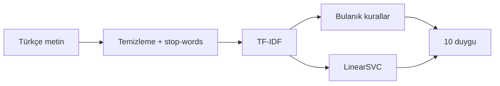

# DuyguAsistan — Türkçe Duygu Analizi

<div align="center">


**TF-IDF + Bulanık Mantık + LinearSVC ile 10 sınıflı Türkçe duygu analizi**

[Özellikler](#özellikler) · [Veri seti](#veri-seti) · [Performans](#performans) · [Kurulum](#kurulum) · [Klasör yapısı](#klasör-yapısı)

</div>

---

## Proje özeti

**DuyguAsistan**, Türkçe metinlerde (tweet / kısa cümle) duygu tespiti yapan bir araştırma ve demo sistemidir.

- **Yorumlanabilir yol:** Bulanık mantık (üçgen üyelik + kural tabanı)
- **Yüksek doğruluk yolu (aktif):** TF-IDF + dengeli **LinearSVC** (kalibre)
- **Arayüz:** Profesyonel Streamlit sohbet deneyimi + sol proje paneli

**2026 güncellemesi:** Veri kütüphanesi ~5.1k → **~22.5k**; curated eğitim seti **~11k**; aktif model accuracy **%78.2**.


```mermaid
flowchart LR
  A[Türkçe metin] --> B[Temizleme + stop-words]
  B --> C[TF-IDF]
  C --> D1[Bulanık kurallar]
  C --> D2[LinearSVC]
  D1 --> E[10 duygu]
  D2 --> E
```

---

## Özellikler

| Teknik | Arayüz |
|--------|--------|
| Dual model: Fuzzy + LinearSVC | Streamlit sohbet (**DuyguAsistan**) |
| 5 üyelik tipi karşılaştırması (fuzzy) | Anlık duygu + güven skoru |
| Türkçe temizleme + stop-words | Alternatif duygu chip’leri |
| TF-IDF (1–3 gram) | Sol panel: metrikler, veri, mimari, görseller |
| Genişletilmiş çok kaynaklı korpus | Hazır örnek cümleler |

---

## Veri seti

### İki katmanlı veri stratejisi

| Katman | Dosya | Boyut | Amaç |
|--------|-------|------:|------|
| **Kütüphane** | `data/turkish_emotion_corpus.csv` | **~22.584** | Sunum / istatistik / geniş kapsama |
| **Eğitim seti** | `TurkishTweets.xlsx` | **~10.973** | Model eğitimi (kalite filtreli) |
| **Orijinal yedek** | `data/TurkishTweets_original_backup.xlsx` | ~5.113 | Değiştirilmeden saklanır |

### Kaynaklar

1. Orijinal **TurkishTweets** (10 sınıf)
2. Hugging Face: [`nihalenc/turkish-8class-emotion-dataset`](https://huggingface.co/datasets/nihalenc/turkish-8class-emotion-dataset)
3. TRSAv1 indirildi ancak **ürün yorumu domain kayması** nedeniyle final korpusa **alınmadı**

### Eğitim seti sınıf dağılımı (~11k)

| Duygu | Adet |
|-------|-----:|
| mutlu | 1.913 |
| kızgın | 1.904 |
| korku | 1.831 |
| üzgün | 1.807 |
| surpriz | 1.622 |
| Umutsuz | 1.049 |
| Heyecanlı | 250 |
| Sorgulayıcı | 244 |
| Şaşırmış | 197 |
| Meraklı | 156 |

Korpusu yeniden üretmek:

```bash
python build_expanded_dataset.py
```

---

## Performans

### Aktif model (sohbet arayüzü)

| Metrik | Değer |
|--------|------:|
| **Model** | `linear_svc_calibrated` |
| **Accuracy** | **78.22%** |
| Precision | 0.783 |
| Recall | 0.782 |
| **F1-Score** | **0.781** |
| R² | 0.641 |
| Ort. güven | ~70.8% |
| Train / Test | 8.778 / 2.195 |

### Model karşılaştırması

| Model | Accuracy | F1 |
|-------|---------:|---:|
| **LinearSVC (calibrated)** | **78.2%** | **0.781** |
| Logistic Regression | 77.8% | 0.779 |
| Fuzzy triangular | 53.9% | 0.557 |

> Bulanık model yorumlanabilirlik için saklanır; sohbet tahmini en yüksek skorlu LinearSVC ile yapılır.

Kaynak: `evaluation_report.csv`, `membership_function_comparison.csv`

---

## Kurulum

```bash
# 1) Sanal ortam (önerilir)
python -m venv .venv
# Windows:
.venv\Scripts\Activate.ps1

# 2) Bağımlılıklar
pip install -r requirements.txt

# 3) (İsteğe bağlı) Korpusu yeniden oluştur
python build_expanded_dataset.py

# 4) (İsteğe bağlı) Modelleri yeniden eğit
python train_model.py

# 5) Web arayüzü
streamlit run app.py
```

Tarayıcı: `http://localhost:8501`

Hazır dosyalar repoda:
- `best_sklearn_model.pkl` — **aktif tahmin modeli**
- `best_fuzzy_model.pkl` — bulanık yedek / araştırma
- `preprocessing_artifacts.pkl` — TF-IDF + label encoder

### Pipeline

1. `build_expanded_dataset.py` — kütüphane + curated eğitim seti  
2. `data_preprocessing.py` — temizleme, TF-IDF, split  
3. `train_model.py` — fuzzy + LinearSVC/LR eğitimi, en iyiyi kaydet  
4. `evaluate_model.py` — ek değerlendirme / görseller  
5. `app.py` — Streamlit arayüzü  

---

## Klasör yapısı

```text
TurkceDuyguAnalizi/
├── app.py                              # DuyguAsistan (Streamlit)
├── train_model.py                      # Fuzzy + Sklearn eğitimi
├── build_expanded_dataset.py           # Korpus birleştirici
├── data_preprocessing.py               # Temizleme + TF-IDF
├── fuzzy_sentiment.py                  # Bulanık sınıflandırıcı
├── evaluate_model.py                   # Değerlendirme
├── create_membership_comparison.py     # Karşılaştırma görseli
├── requirements.txt
├── README.md
├── fuzzy_sentiment_readme.md           # Teknik notlar
├── TurkishTweets.xlsx                  # Curated eğitim verisi (~11k)
├── best_sklearn_model.pkl              # Aktif model (LinearSVC)
├── best_fuzzy_model.pkl                # Bulanık model
├── preprocessing_artifacts.pkl
├── evaluation_report.csv
├── membership_function_comparison.csv
├── data/
│   ├── turkish_emotion_corpus.csv      # Geniş kütüphane (~22.5k)
│   ├── dataset_meta.txt
│   ├── TurkishTweets_original_backup.xlsx
│   └── raw/                            # HF ham indirmeler
│       ├── turkish-8class-emotion-dataset.csv
│       ├── TRSAv1.csv                  # (final korpusa dahil değil)
│       └── *.json
└── Gorseller/
    ├── metrics_comparison.png
    ├── membership_function_comparison.png
    ├── confusion_matrix.png
    ├── class_distribution.png
    └── confidence_distribution.png
```

---

## Teknik özet

| Bileşen | Ayar |
|---------|------|
| Vektörizer | `TfidfVectorizer(max_features=2500, ngram_range=(1,3), min_df=2, max_df=0.92, sublinear_tf=True)` |
| Aktif model | `CalibratedClassifierCV(LinearSVC, class_weight=balanced)` |
| Fuzzy | triangular, `n_features=150`, dengeli örnekleme |
| Split | %80 / %20 stratified |
| Arayüz | Streamlit · IBM Plex Sans + Libre Baskerville |

Ayrıntılar: [`fuzzy_sentiment_readme.md`](fuzzy_sentiment_readme.md)

---

## Duygu sınıfları

| Sınıf | Anlam |
|-------|-------|
| mutlu | Pozitif / neşeli |
| üzgün | Üzüntü / hayal kırıklığı |
| korku | Endişe / korku |
| kızgın | Öfke / rahatsızlık |
| surpriz | Beklenmedik durum |
| Şaşırmış | Hayret |
| Heyecanlı | Enerji / heyecan |
| Meraklı | İlgi / merak |
| Sorgulayıcı | Soru / sorgulama |
| Umutsuz | Yılgınlık / umutsuzluk |

---

## Lisans

Eğitim ve araştırma amaçlıdır.

---

<div align="center">

**DuyguAsistan** · Fuzzy Logic · TF-IDF · LinearSVC · Streamlit

</div>
