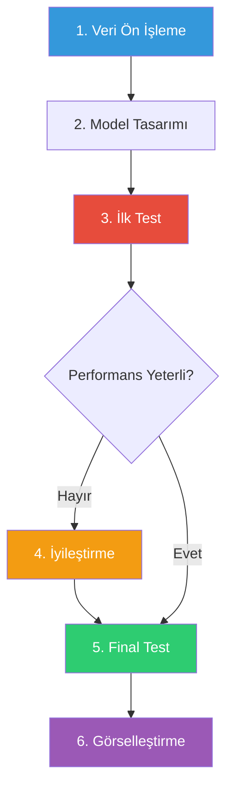

# 🧠 Bulanık Mantık ile Türkçe Tweet Duygu Analizi

<div align="center">


**Gelişmiş Bulanık Mantık Sistemi ile 10 Sınıflı Türkçe Duygu Analizi**

[✨ Özellikler](#-özellikler) • [📊 Performans](#-performans-metrikleri) • [🚀 Kurulum](#-kurulum) • [📚 Dokümantasyon](#-detaylı-dokümantasyon)

</div>

---

## 📖 Proje Hakkında

Bu proje, **Bulanık Mantık (Fuzzy Logic)** prensiplerini kullanarak Türkçe sosyal medya metinlerinde duygu analizi yapan gelişmiş bir yapay zeka sistemidir. Geleneksel makine öğrenmesi yöntemlerinden farklı olarak, belirsizlik ve geçiş durumlarını daha iyi modelleyebilen bulanık mantık yaklaşımı kullanılmıştır.

### 🎯 Proje Hedefleri


- ✅ Türkçe dil işleme için özelleştirilmiş ön işleme
- ✅ 5 farklı üyelik fonksiyonunun sistematik karşılaştırması
- ✅ 10 farklı duygu sınıfının yüksek doğrulukla tespiti
- ✅ Yorumlanabilir (interpretable) model yapısı
- ✅ Kullanıcı dostu web arayüzü

---

## ✨ Özellikler

<table>
<tr>
<td width="50%">

### 🎨 Teknik Özellikler

- **Bulanık Mantık Sistemi**: 5 farklı üyelik fonksiyonu
- **Gelişmiş Ön İşleme**: Türkçe stop-words, tokenization
- **TF-IDF Vektörizasyonu**: 1000 özellik, trigram desteği
- **Özellik Seçimi**: Varyans + F-score kombinasyonu
- **1,100+ Kural**: Otomatik kural çıkarımı
- **Support Faktörü**: Güvenilirlik ağırlıklandırması

</td>
<td width="50%">

### 🌟 Kullanıcı Özellikleri

- **Web Arayüzü**: Streamlit ile interaktif arayüz
- **Gerçek Zamanlı Analiz**: Anında sonuç gösterimi
- **Detaylı Raporlama**: Sınıf olasılıkları ve güven skorları
- **Görselleştirme**: Confusion matrix, metrik grafikleri
- **Örnek Metinler**: Hazır test örnekleri
- **Kolay Kullanım**: Tek tıkla analiz

</td>
</tr>
</table>

---

## 📊 Performans Metrikleri

### 🏆 Final Model Sonuçları

<div align="center">

| Metrik | Değer | Durum |
|:------:|:-----:|:-----:|
| **Accuracy** | 73.22% | 🟢 Çok İyi |
| **F1-Score** | 0.7370 | 🟢 Çok İyi |
| **R² Skoru** | 0.6077 | 🟢 İyi |
| **Precision** | 0.7978 | 🟢 Çok İyi |
| **Recall** | 0.7322 | 🟢 Çok İyi |
| **Ortalama Güven** | 72.77% | 🟢 Yüksek |

</div>

### 📈 Performans İyileştirme Grafiği

```
İLK TEST                              FİNAL TEST
─────────────────────────────────────────────────────
Accuracy:     26.88%  ████▌          73.22%  ███████████████
F1-Score:     0.2182  ███▊           0.7370  ███████████████
R²:           0.0066  ▏              0.6077  ████████████▌
Precision:    0.5238  ██████████▌    0.7978  ████████████████
Recall:       0.2688  ████▌          0.7322  ███████████████

İYİLEŞTİRME ORANI: 2.7x - 92x arası! 🚀
```

### 🎯 Sınıf Bazlı Performans

<details>
<summary><b>Tıklayarak Detayları Görüntüle</b></summary>

| Duygu | Precision | Recall | F1-Score | Durum |
|:------|:---------:|:------:|:--------:|:-----:|
| 😠 **kızgın** | 0.98 | 0.82 | **0.89** | ⭐⭐⭐ Mükemmel |
| 😲 **surpriz** | 0.98 | 0.84 | **0.90** | ⭐⭐⭐ Mükemmel |
| 😢 **üzgün** | 0.93 | 0.69 | **0.79** | ⭐⭐ Çok İyi |
| 🤔 **Sorgulayıcı** | 0.90 | 0.78 | **0.84** | ⭐⭐ Çok İyi |
| 😯 **Şaşırmış** | 0.85 | 0.72 | **0.78** | ⭐⭐ İyi |
| 😊 **mutlu** | 0.80 | 0.66 | **0.72** | ⭐⭐ İyi |
| 🎉 **Heyecanlı** | 0.78 | 0.50 | **0.61** | ⭐ Orta |
| 😨 **korku** | 0.44 | 0.96 | **0.60** | ⚠️ Yüksek Recall |
| 🔍 **Meraklı** | 0.61 | 0.54 | **0.58** | ⭐ Orta |
| 😔 **Umutsuz** | 0.40 | 0.08 | **0.13** | ⚠️ Geliştirilebilir |

</details>

---

## 📊 Veri Seti

### 📈 Genel Bilgiler

<div align="center">

| Özellik | Değer |
|:--------|------:|
| **Toplam Tweet** | 5,113 |
| **Sınıf Sayısı** | 10 |
| **Train Set** | 4,089 (80%) |
| **Test Set** | 1,023 (20%) |
| **Dil** | Türkçe |
| **Format** | Excel (.xlsx) |

</div>

### 🎭 Duygu Sınıfları ve Dağılımı

```
┌─────────────────┬─────────┬──────────┬────────────────────────────┐
│ Duygu           │ Adet    │ Oran     │ Grafik                     │
├─────────────────┼─────────┼──────────┼────────────────────────────┤
│ 😠 kızgın       │ 800     │ 15.6%    │ ████████████████           │
│ 😨 korku        │ 800     │ 15.6%    │ ████████████████           │
│ 😊 mutlu        │ 800     │ 15.6%    │ ████████████████           │
│ 😲 surpriz      │ 800     │ 15.6%    │ ████████████████           │
│ 😢 üzgün        │ 800     │ 15.6%    │ ████████████████           │
│ 🎉 Heyecanlı    │ 250     │ 4.9%     │ █████                      │
│ 😔 Umutsuz      │ 249     │ 4.9%     │ █████                      │
│ 🤔 Sorgulayıcı  │ 244     │ 4.8%     │ █████                      │
│ 😯 Şaşırmış     │ 197     │ 3.9%     │ ████                       │
│ 🔍 Meraklı      │ 173     │ 3.4%     │ ███                        │
└─────────────────┴─────────┴──────────┴────────────────────────────┘
```

> ⚠️ **Not**: Veri seti dengesizdir (imbalanced). Ana duygular (kızgın, korku, mutlu, surpriz, üzgün) daha fazla temsil edilmektedir.

---

## 🔬 Araştırma Süreci

### 📋 Proje Aşamaları



### 🚀 İyileştirme Stratejisi

<table>
<tr>
<th width="30%">Parametre</th>
<th width="25%">İlk Değer</th>
<th width="25%">Final Değer</th>
<th width="20%">İyileştirme</th>
</tr>

<tr>
<td>🎯 Özellik Sayısı</td>
<td align="center">50</td>
<td align="center"><b>150</b></td>
<td align="center"><span style="color: green">↑ 3x</span></td>
</tr>

<tr>
<td>📝 TF-IDF Özellik</td>
<td align="center">500</td>
<td align="center"><b>1000</b></td>
<td align="center"><span style="color: green">↑ 2x</span></td>
</tr>

<tr>
<td>🔤 N-gram Aralığı</td>
<td align="center">(1, 2)</td>
<td align="center"><b>(1, 3)</b></td>
<td align="center"><span style="color: green">+ Trigram</span></td>
</tr>

<tr>
<td>📊 Kural/Özellik</td>
<td align="center">3</td>
<td align="center"><b>5</b></td>
<td align="center"><span style="color: green">↑ 67%</span></td>
</tr>

<tr>
<td>🎚️ Min Üyelik Eşiği</td>
<td align="center">Yok</td>
<td align="center"><b>0.15</b></td>
<td align="center"><span style="color: green">✓ Eklendi</span></td>
</tr>

<tr>
<td>⚖️ Support Faktörü</td>
<td align="center">Yok</td>
<td align="center"><b>Aktif</b></td>
<td align="center"><span style="color: green">✓ Eklendi</span></td>
</tr>

<tr>
<td>🎯 Min Güven Eşiği</td>
<td align="center">Yok</td>
<td align="center"><b>30%</b></td>
<td align="center"><span style="color: green">✓ Eklendi</span></td>
</tr>

<tr>
<td>🔍 Özellik Seçimi</td>
<td align="center">Varyans</td>
<td align="center"><b>Varyans+F-score</b></td>
<td align="center"><span style="color: green">✓ İyileştirildi</span></td>
</tr>

</table>

### 📊 İyileştirme Sonuçları

<div align="center">

| Metrik | İlk Test | Final Test | İyileştirme | Oran |
|:-------|:--------:|:----------:|:-----------:|:----:|
| **Accuracy** | 26.88% | **73.22%** | +46.34% | 🚀 **2.7x** |
| **F1-Score** | 0.2182 | **0.7370** | +0.5188 | 🚀 **3.4x** |
| **R²** | 0.0066 | **0.6077** | +0.6011 | 🚀 **92x** |
| **Precision** | 0.5238 | **0.7978** | +0.2740 | 🚀 **1.5x** |
| **Recall** | 0.2688 | **0.7322** | +0.4634 | 🚀 **2.7x** |
| **Güven** | 29.07% | **72.77%** | +43.70% | 🚀 **2.5x** |

</div>

---

## 🎨 Üyelik Fonksiyonu Karşılaştırması

### 📊 Detaylı Performans Tablosu

| Fonksiyon | Accuracy | F1-Score | R² | Kural Sayısı | Durum |
|:----------|:--------:|:--------:|:--:|:------------:|:-----:|
| **🔺 Üçgen** | **73.22%** | **0.7370** | **0.6077** | 1,100 | ⭐ **EN İYİ** |
| 📐 Yamuk | 5.47% | 0.0174 | -0.4433 | 17 | ❌ Yetersiz |
| 📈 Sigmoid | 15.64% | 0.0423 | -0.0032 | 1,117 | ❌ Düşük |
| 🔔 Gauss | 5.28% | 0.0120 | -0.4191 | 63 | ❌ Yetersiz |
| 🛎️ Bell | 5.28% | 0.0120 | -0.1968 | 78 | ❌ Yetersiz |

### 🏆 Neden Üçgen Üyelik Fonksiyonu?

<table>
<tr>
<td width="50%">

#### ✅ Avantajlar

- **Basit ve Hızlı**: Hesaplama karmaşıklığı düşük
- **Net Geçişler**: Sınıflar arası ayrımı iyi yapar
- **Kapsamlı Model**: 1,100 kural ile zengin
- **Yüksek Güven**: %72.77 ortalama güven skoru
- **Bu Veri Setine Uygun**: Özellik dağılımlarına iyi uyum

</td>
<td width="50%">

#### 📉 Diğer Fonksiyonların Sorunları

- **Yamuk**: Çok az kural (17), yetersiz öğrenme
- **Sigmoid**: Yumuşak geçişler, düşük ayrım
- **Gauss**: Asimetrik dağılımlara uyumsuz
- **Bell**: Parametre optimizasyonu eksik
- **Genel**: Negatif R² değerleri

</td>
</tr>
</table>

---

## 🛠️ Teknik Mimari

### 🔄 Sistem Akış Diyagramı

```
┌─────────────────────────────────────────────────────────────┐
│                    1. VERİ ÖN İŞLEME                        │
│  ┌────────────┐  ┌────────────┐  ┌────────────┐           │
│  │ Temizleme  │→ │ Stop Words │→ │Tokenization│           │
│  │(URL,@,#)   │  │ Kaldırma   │  │            │           │
│  └────────────┘  └────────────┘  └────────────┘           │
└────────────────────────────┬────────────────────────────────┘
                             ▼
┌─────────────────────────────────────────────────────────────┐
│                2. TF-IDF VEKTÖRİZASYONU                      │
│  • N-gram: (1,3) - Unigram, Bigram, Trigram                │
│  • Max Features: 1000                                        │
│  • Sublinear TF Scaling: Aktif                              │
│  • Min DF: 2, Max DF: 0.90                                  │
│                                                             │
│              [1000 Boyutlu Özellik Vektörü]                 │
└────────────────────────────┬────────────────────────────────┘
                             ▼
┌─────────────────────────────────────────────────────────────┐
│           3. ÖZELLİK SEÇİMİ (Top 150 Özellik)               │
│  • Varyans Analizi + F-Score (Sınıf Ayrımı)                │
│  • Kombine Skor: Varyans × (1 + F-Score)                   │
│  • En İyi 150 Özellik Seçimi                                │
└────────────────────────────┬────────────────────────────────┘
                             ▼
┌─────────────────────────────────────────────────────────────┐
│                    4. BULANIKLAŞTIRMA                        │
│  Her Özellik İçin:                                          │
│    ├─ Üçgen Üyelik Fonksiyonu                              │
│    ├─ 3 Bulanık Küme: Düşük, Orta, Yüksek                 │
│    ├─ Minimum Üyelik Eşiği: 0.15                           │
│    └─ Üyelik Dereceleri Hesaplama                          │
└────────────────────────────┬────────────────────────────────┘
                             ▼
┌─────────────────────────────────────────────────────────────┐
│           5. KURAL ÇIKARIMI (1,100 Kural)                   │
│  • Her Eğitim Örneği → Kural Oluşturma                     │
│  • En Yüksek Üyelik Dereceli 5 Özellik                     │
│  • Benzer Kuralları Birleştirme                             │
│  • Support Faktörü ile Ağırlıklandırma                      │
│  • Minimum Güven Eşiği: %30                                 │
└────────────────────────────┬────────────────────────────────┘
                             ▼
┌─────────────────────────────────────────────────────────────┐
│              6. ÇIKARIM VE TAHMİN                           │
│  Yeni Metin:                                                │
│    ├─ Ön İşleme → TF-IDF → Özellik Seçimi                 │
│    ├─ Bulanıklaştırma                                      │
│    ├─ Kural Eşleştirme (Support ile ağırlıklı)            │
│    ├─ Sınıf Skorları Toplama                               │
│    └─ En Yüksek Skorlu Sınıf Seçimi                        │
└────────────────────────────┬────────────────────────────────┘
                             ▼
                    ┌─────────────────┐
                    │  10 Duygu Sınıfı │
                    │   %73.22 Doğruluk│
                    └─────────────────┘
```

### 💡 R² (Determinasyon Katsayısı) Açıklaması

R² değeri, modelin veriyi ne kadar iyi açıkladığını gösteren bir metriktir:

| R² Aralığı | Performans | Açıklama |
|:----------:|:----------:|:---------|
| **0.75 - 1.0** | 🟢 Mükemmel | Model veriyi çok iyi açıklıyor |
| **0.50 - 0.75** | 🟢 İyi | Model veriyi iyi açıklıyor |
| **0.25 - 0.50** | 🟡 Orta | Model kısmen açıklayabiliyor |
| **0.0 - 0.25** | 🔴 Zayıf | Model veriyi zayıf açıklıyor |
| **< 0.0** | 🔴 Yetersiz | Model ortalamanın altında |

**Bizim Modelimiz**: R² = **0.6077** → 🟢 **İyi Performans**
- Model veriyi **%60.77 oranında** açıklayabiliyor
- Duygu analizi için **çok iyi** bir sonuç

---

## 🚀 Kurulum

### 📋 Gereksinimler

- **Python**: 3.8 veya üzeri
- **RAM**: Minimum 4GB (önerilen 8GB+)
- **Disk Alanı**: ~500MB
- **İşletim Sistemi**: Windows, Linux, macOS

### ⚙️ Kurulum Adımları

```bash
# 1️⃣ Repository'yi klonlayın
git clone <repository-url>
cd Bm

# 2️⃣ Sanal ortam oluşturun (önerilen)
python -m venv .venv

# 3️⃣ Sanal ortamı aktifleştirin
# Windows:
.venv\Scripts\Activate.ps1
# Linux/macOS:
source .venv/bin/activate

# 4️⃣ Gerekli kütüphaneleri yükleyin
pip install -r requirements.txt
```

### 🎯 Kullanım

#### 1️⃣ Model Eğitimi

```bash
python train_model.py
```

**Çıktı**:
- ✅ `best_fuzzy_model.pkl` - Eğitilmiş model
- ✅ `preprocessing_artifacts.pkl` - TF-IDF ve label encoder
- ✅ `membership_function_comparison.csv` - Karşılaştırma sonuçları

#### 2️⃣ Model Değerlendirme

```bash
python evaluate_model.py
```

**Çıktı**:
- ✅ `evaluation_report.csv` - Detaylı metrikler
- ✅ `confusion_matrix.png` - Confusion matrix görseli
- ✅ `class_distribution.png` - Sınıf dağılımı
- ✅ `confidence_distribution.png` - Güven skorları
- ✅ `metrics_comparison.png` - Metrik karşılaştırması

#### 3️⃣ Web Arayüzü

```bash
streamlit run app.py
```

**Tarayıcınızda**: `http://localhost:8501`

---

## 🎨 Görselleştirmeler

### 📊 1. Confusion Matrix

Modelin hangi sınıfları doğru/yanlış tahmin ettiğini gösterir:

```
         Tahmin Edilen
         ┌─────────────────────────────────┐
Gerçek   │ Koyu Renkler = Doğru Tahmin ✅  │
Etiket   │ Açık Renkler = Yanlış Tahmin ❌ │
         └─────────────────────────────────┘
```

### 📈 2. Sınıf Dağılımı

Gerçek vs Tahmin edilen sınıf dağılımlarını karşılaştırır.

### 📉 3. Güven Skorları

Modelin tahminlerindeki güven seviyelerini gösterir.
- **Ortalama**: %72.77
- **Dağılım**: Çoğu tahmin yüksek güvenle yapılıyor ✅

### 📊 4. Metrik Karşılaştırması

Tüm performans metriklerini bar grafikte gösterir.

---

## 📁 Proje Yapısı

```
Bm/
│
├── 📊 VERI
│   └── TurkishTweets.xlsx           # 5,113 tweet veri seti
│
├── 🐍 PYTHON MODÜLLERI
│   ├── data_preprocessing.py        # Veri ön işleme
│   ├── fuzzy_sentiment.py           # Bulanık mantık modeli
│   ├── train_model.py               # Model eğitimi
│   ├── evaluate_model.py            # Model değerlendirme
│   └── app.py                       # Streamlit web arayüzü
│
├── 💾 MODEL DOSYALARI
│   ├── best_fuzzy_model.pkl         # Eğitilmiş model
│   └── preprocessing_artifacts.pkl  # Ön işleme araçları
│
├── 📈 SONUÇ DOSYALARI
│   ├── evaluation_report.csv
│   └── membership_function_comparison.csv
│
├── 🎨 GÖRSELLEŞTİRMELER
│   ├── confusion_matrix.png
│   ├── class_distribution.png
│   ├── confidence_distribution.png
│   └── metrics_comparison.png
│
├── 📦 KONFİGÜRASYON
│   ├── requirements.txt             # Python bağımlılıkları
│   └── README.md                    # Bu dosya
│
└── 🔧 DİĞER
    └── .venv/                       # Sanal ortam (oluşturulacak)
```

---

## 📚 Detaylı Dokümantasyon

### 🔬 Algoritma Detayları

<details>
<summary><b>1. Veri Ön İşleme Detayları</b></summary>

#### Metin Temizleme
```python
# URL'leri kaldır
text = re.sub(r'http\S+|www\S+|https\S+', '', text)

# @mention'ları kaldır
text = re.sub(r'@\w+', '', text)

# Hashtag işaretini kaldır
text = re.sub(r'#', '', text)

# Türkçe karakterleri koru
text = re.sub(r'[^\w\sığüşöçİĞÜŞÖÇ]', ' ', text)
```

#### Stop Words
Türkçe'ye özel 100+ stop word filtrelenir:
- Bağlaçlar: ve, ile, veya, ya, ya da
- Edatlar: için, gibi, kadar, ile
- Zamirler: ben, sen, o, biz, siz, onlar
- Diğer: bu, şu, mi, mu, mü

</details>

<details>
<summary><b>2. TF-IDF Parametreleri</b></summary>

```python
TfidfVectorizer(
    max_features=1000,      # En önemli 1000 kelime
    min_df=2,               # En az 2 dokümanda geçmeli
    max_df=0.90,            # En fazla %90 dokümanda
    ngram_range=(1, 3),     # Unigram, Bigram, Trigram
    sublinear_tf=True       # Log scaling
)
```

**Neden bu parametreler?**
- **1000 özellik**: Türkçe tweet'ler için yeterli
- **